# Technical Specifications

## Core Architecture Diagram

```mermaid
classDiagram
    %% Core Engine Classes
    class ComponentEngine {
        <<Static Class>>
        +createComponent(type: ComponentType) FormComponent
        +updateComponent(components: FormComponent[], id: string, updates: Partial) FormComponent[]
        +removeComponent(components: FormComponent[], id: string) FormComponent[]
        +findComponent(components: FormComponent[], id: string) FormComponent | null
        +validateComponent(component: FormComponent) ValidationResult
        +getAllComponentTypes() ComponentType[]
        +getDefaultLabel(type: ComponentType) string
    }

    class FormStateEngine {
        <<Static Class>>
        +executeAction(state: FormState, action: FormAction) FormState
        +getCurrentPageComponents(pages: FormPage[], pageId: string) FormComponent[]
        +validateFormState(pages: FormPage[]) ValidationResult
        -addComponent(state: FormState, payload: AddComponentPayload) FormState
        -updateComponent(state: FormState, payload: UpdateComponentPayload) FormState
        -deleteComponent(state: FormState, payload: DeleteComponentPayload) FormState
    }

    class ComponentRenderer {
        <<Static Class>>
        +renderComponent(component: FormComponent, mode: 'builder' | 'preview') ReactElement
        +getComponentInfo(type: ComponentType) ComponentInfo
        -renderBuilderMode(component: FormComponent) ReactElement
        -renderPreviewMode(component: FormComponent) ReactElement
    }

    class DragDropService {
        <<Static Class>>
        +handleDrop(draggedType: ComponentType, targetId: string, position: DropPosition, state: FormState) FormState
        +calculateDropPosition(mousePosition: Point, targetBounds: DOMRect) DropPosition
        -createHorizontalLayout(components: FormComponent[]) FormComponent
        -dissolveContainer(containerId: string, components: FormComponent[]) FormComponent[]
    }

    ComponentEngine --> FormComponent
    FormStateEngine --> FormState
    FormStateEngine --> FormAction
    ComponentRenderer --> FormComponent
    DragDropService --> FormState
```



## Layout Transformation State Machine

### State Definitions

```typescript
type LayoutState = 'empty' | 'single' | 'two_vertical' | 'two_horizontal' | 'multi_mixed';

interface LayoutTransition {
  from: LayoutState;
  to: LayoutState;
  trigger: 'drop_component' | 'arrange_horizontal' | 'arrange_vertical' | 'remove_component';
  conditions: string[];
}
```

### State Transitions

#### State 1: Empty Canvas
```
Canvas (Column Layout - Default Mode)
├── [Empty] - Available drop zones: center
└── Action: Drop any component → State 2 (Single)
```

#### State 2: Single Element  
```
Canvas (Column Layout)
├── Component A 
└── Available drop zones: top, bottom
└── Action: Drop component → State 3A (Two Vertical) OR State 3B (Two Horizontal)
```

#### State 3A: Two Elements - Vertical
```
Canvas (Column Layout)  
├── Component A - Drop zones: top, bottom
├── Component B - Drop zones: top, bottom  
└── Transform: Side-by-side drop → State 3B (Two Horizontal)
```

#### State 3B: Two Elements - Horizontal
```
Canvas (Column Layout)
└── Horizontal Layout Container
    ├── Component A - Drop zones: left, right
    └── Component B - Drop zones: left, right
└── Transform: Vertical drop → State 3A OR State 4 (Multi Mixed)
```

#### State 4: Multi-Mixed Layout
```
Canvas (Column Layout)
├── Component C - Drop zones: top, bottom
├── Horizontal Layout Container - Drop zones: top, bottom (container level)
│   ├── Component A - Drop zones: left, right (element level)  
│   └── Component B - Drop zones: left, right (element level)
└── Component D - Drop zones: top, bottom
```

## Performance Specifications

### Lazy Loading Implementation

**Target Metrics**:
- Initial render time: < 200ms for 100+ components
- Memory usage: < 100MB for 1000+ component forms
- Scroll performance: 60fps maintained during virtualization

**Implementation Details**:
```typescript
interface LazyLoadingConfig {
  chunkSize: number;          // Default: 10 components per chunk
  threshold: number;          // Default: 0.1 (10% visibility)
  rootMargin: string;         // Default: "100px" preload margin
  renderTimeout: number;      // Default: 16ms (60fps budget)
}

class LazyRenderer {
  private observer: IntersectionObserver;
  private loadedChunks: Set<number>;
  private pendingChunks: Map<number, Promise<void>>;
  
  loadChunk(chunkIndex: number): Promise<void>;
  unloadChunk(chunkIndex: number): void;
  calculateChunkBounds(components: FormComponent[]): ChunkBounds[];
}
```

### Virtualization Specifications

**Virtual Scrolling Parameters**:
```typescript
interface VirtualScrollConfig {
  itemHeight: number;         // Fixed or estimated height per item
  containerHeight: number;    // Visible container height
  overscan: number;          // Extra items to render (default: 5)
  scrollThreshold: number;   // Pixels before triggering scroll updates
}

interface VirtualScrollState {
  scrollTop: number;
  startIndex: number;
  endIndex: number;
  totalHeight: number;
  visibleItems: ComponentRenderInfo[];
}
```

## Component Panel Business Logic (Left Panel Structure)

### Input Components Category
```json
{
  "category": "input_components",
  "icon": "📝",
  "label": "Input Components",
  "components": [
    {
      "type": "text_input",
      "label": "Text Input",
      "description": "Single line text field"
    },
    {
      "type": "email_input", 
      "label": "Email Input",
      "description": "Email address field with validation"
    },
    {
      "type": "password_input",
      "label": "Password Input", 
      "description": "Password field with masking"
    },
    {
      "type": "number_input",
      "label": "Number Input",
      "description": "Numeric input with validation"
    },
    {
      "type": "textarea",
      "label": "Text Area",
      "description": "Multi-line text input"
    },
    {
      "type": "rich_text",
      "label": "Rich Text Editor",
      "description": "WYSIWYG text editor"
    }
  ]
}
```

### Selection Components Category
```json
{
  "category": "selection_components",
  "icon": "☑️",
  "label": "Selection Components",
  "components": [
    {
      "type": "select",
      "label": "Select Dropdown",
      "description": "Single selection dropdown"
    },
    {
      "type": "multi_select",
      "label": "Multi Select",
      "description": "Multiple selection dropdown"
    },
    {
      "type": "checkbox",
      "label": "Checkbox",
      "description": "Single checkbox input"
    },
    {
      "type": "radio_group",
      "label": "Radio Group",
      "description": "Single selection from multiple options"
    }
  ]
}
```

### Special Components Category
```json
{
  "category": "special_components",
  "icon": "⭐",
  "label": "Special Components",
  "components": [
    {
      "type": "date_picker",
      "label": "Date Picker",
      "description": "Calendar date selection"
    },
    {
      "type": "file_upload",
      "label": "File Upload",
      "description": "File selection and upload"
    },
    {
      "type": "signature",
      "label": "Signature Pad",
      "description": "Digital signature capture"
    }
  ]
}
```

### Layout Components Category
```json
{
  "category": "layout_components",
  "icon": "📐",
  "label": "Layout Components",
  "components": [
    {
      "type": "horizontal_layout",
      "label": "Horizontal Layout",
      "description": "Container for side-by-side components"
    },
    {
      "type": "vertical_layout",
      "label": "Vertical Layout", 
      "description": "Container for stacked components"
    }
  ]
}
```

### UI Components Category
```json
{
  "category": "ui_components",
  "icon": "🎨",
  "label": "UI Components",
  "components": [
    {
      "type": "section_divider",
      "label": "Section Divider",
      "description": "Visual separator between form sections"
    },
    {
      "type": "button",
      "label": "Button",
      "description": "Action button for form interactions"
    },
    {
      "type": "heading",
      "label": "Heading",
      "description": "Section heading or title"
    },
    {
      "type": "card",
      "label": "Card Container",
      "description": "Visual card container for grouping"
    }
  ]
}
```

## Drop Zone Hierarchy Specifications

### Zone Priority System
```typescript
enum DropZonePriority {
  COMPONENT_LEVEL = 1,    // Direct component replacement
  CONTAINER_LEVEL = 2,    // Row/column arrangement within container
  CANVAS_LEVEL = 3        // Top-level layout management
}

interface DropZone {
  id: string;
  priority: DropZonePriority;
  bounds: DOMRect;
  targetComponent?: FormComponent;
  position: DropPosition;
  containerType?: 'horizontal_layout' | 'vertical_layout';
}
```

### Drop Position Calculation
```typescript
function calculateDropPosition(
  mousePoint: Point,
  targetBounds: DOMRect,
  containerType: 'horizontal' | 'vertical'
): DropPosition {
  const threshold = 0.25; // 25% threshold for edge detection
  
  if (containerType === 'horizontal') {
    const leftThreshold = targetBounds.left + (targetBounds.width * threshold);
    const rightThreshold = targetBounds.right - (targetBounds.width * threshold);
    
    if (mousePoint.x < leftThreshold) return 'left';
    if (mousePoint.x > rightThreshold) return 'right';
    return 'inside';
  } else {
    const topThreshold = targetBounds.top + (targetBounds.height * threshold);
    const bottomThreshold = targetBounds.bottom - (targetBounds.height * threshold);
    
    if (mousePoint.y < topThreshold) return 'before';
    if (mousePoint.y > bottomThreshold) return 'after';
    return 'inside';
  }
}
```

## Validation Engine Specifications

### Component Validation Rules
```typescript
interface ValidationRule {
  type: 'required' | 'pattern' | 'length' | 'custom';
  message: string;
  validator: (value: any, component: FormComponent) => boolean;
}

const VALIDATION_RULES: Record<ComponentType, ValidationRule[]> = {
  'email_input': [
    {
      type: 'pattern',
      message: 'Please enter a valid email address',
      validator: (value) => /^[^\s@]+@[^\s@]+\.[^\s@]+$/.test(value)
    }
  ],
  'number_input': [
    {
      type: 'custom',
      message: 'Please enter a valid number',
      validator: (value, component) => {
        const num = Number(value);
        if (isNaN(num)) return false;
        if (component.min !== undefined && num < component.min) return false;
        if (component.max !== undefined && num > component.max) return false;
        return true;
      }
    }
  ]
};
```

## Performance Optimization Implementation Details

### Lazy Loading System
**File**: `src/shared/components/LazyFormRenderer.tsx`

**Features Implementation**:
- **Component Chunking**: Splits large forms into manageable chunks (default: 10 components per chunk)
- **Intersection Observer**: Only renders components when they become visible in the viewport
- **Progressive Loading**: Loads form sections as users scroll, reducing initial render time
- **Height Estimation**: Smart estimation of component heights based on component types
- **Memory Efficient**: Reduces memory footprint for massive forms

**Usage Pattern**:
```typescript
<LazyFormRenderer
  components={formComponents}
  renderComponent={(component, index) => (
    <ComponentRenderer component={component} />
  )}
  chunkSize={10}
  threshold={0.1}
  rootMargin="100px"
/>
```

**Performance Impact Targets**:
- ✅ **90%+ faster** initial render for forms with 100+ components
- ✅ **Reduced memory usage** by 60-80% for large forms
- ✅ **Improved user experience** with progressive loading

### React.memo Optimization System
**File**: `src/shared/components/ComponentRenderer.tsx`

**Features**:
- **Custom Comparison Function**: Optimized shallow comparison for component props
- **Selective Re-rendering**: Only re-renders when specific props change
- **Deep Comparison**: Smart comparison for complex props like options arrays
- **Display Names**: Proper component names for debugging

**Implementation Pattern**:
```typescript
export const ComponentRenderer = memo(ComponentRendererImpl, (prevProps, nextProps) => {
  return (
    prevProps.component.id === nextProps.component.id &&
    prevProps.component.type === nextProps.component.type &&
    prevProps.component.label === nextProps.component.label &&
    // ... other optimized comparisons
  );
});
```

**Performance Impact Targets**:
- ✅ **50-70% reduction** in unnecessary re-renders
- ✅ **Improved form interaction** responsiveness
- ✅ **Lower CPU usage** during form editing

### Performance Monitoring System
**File**: `src/shared/hooks/usePerformanceMonitor.ts`

**Features**:
- **Real-time Monitoring**: Tracks render times and re-render counts
- **Memory Leak Detection**: Monitors memory usage trends
- **Performance Warnings**: Automatic alerts for slow components
- **Global Performance Tracking**: App-wide performance insights
- **Development Tools**: Performance debugging utilities

**Usage Pattern**:
```typescript
const { metrics, warnings, getPerformanceSummary } = usePerformanceMonitor({
  componentName: 'MyComponent',
  slowRenderThreshold: 16, // 60fps
  reRenderWarningThreshold: 10
});
```

**Monitoring Capabilities**:
- ✅ **Component render time** tracking
- ✅ **Memory usage** monitoring  
- ✅ **Performance bottleneck** identification
- ✅ **Real-time warnings** for optimization opportunities

### Performance Benchmarks

#### Before Optimization Metrics
- **Large Form (200 components)**: 800-1200ms initial render
- **Memory Usage**: 150-200MB for complex forms
- **Scroll Performance**: 30-40fps with frame drops
- **Re-render Count**: High unnecessary re-renders

#### After Optimization Targets
- **Large Form (200 components)**: 80-150ms initial render
- **Memory Usage**: 50-80MB for same forms
- **Scroll Performance**: Consistent 60fps
- **Re-render Count**: 70% reduction in unnecessary renders

### Performance Testing Requirements

#### Test Scenarios for Implementation
```typescript
interface PerformanceTestScenarios {
  small: { 
    components: 10, 
    expectedRenderTime: '<50ms',
    memoryTarget: '<20MB'
  };
  medium: { 
    components: 50, 
    expectedRenderTime: '<150ms',
    memoryTarget: '<40MB'
  };
  large: { 
    components: 200, 
    expectedRenderTime: '<300ms',
    memoryTarget: '<80MB'
  };
  massive: { 
    components: 1000, 
    expectedRenderTime: '<1000ms',
    memoryTarget: '<150MB'
  };
}
```

#### Memory Usage Testing Targets
```typescript
interface MemoryTestTargets {
  initialLoad: { target: '<50MB', components: 100 };
  afterInteraction: { target: '<80MB', interactions: 50 };
  longSession: { target: '<100MB', duration: '30min' };
  memoryLeaks: { 
    maxGrowth: '10MB/hour', 
    gcEfficiency: '>90%' 
  };
}
```

This technical specification captures the detailed implementation information that was in the deleted specialized documents while maintaining the clean 4-document structure for day-to-day use.