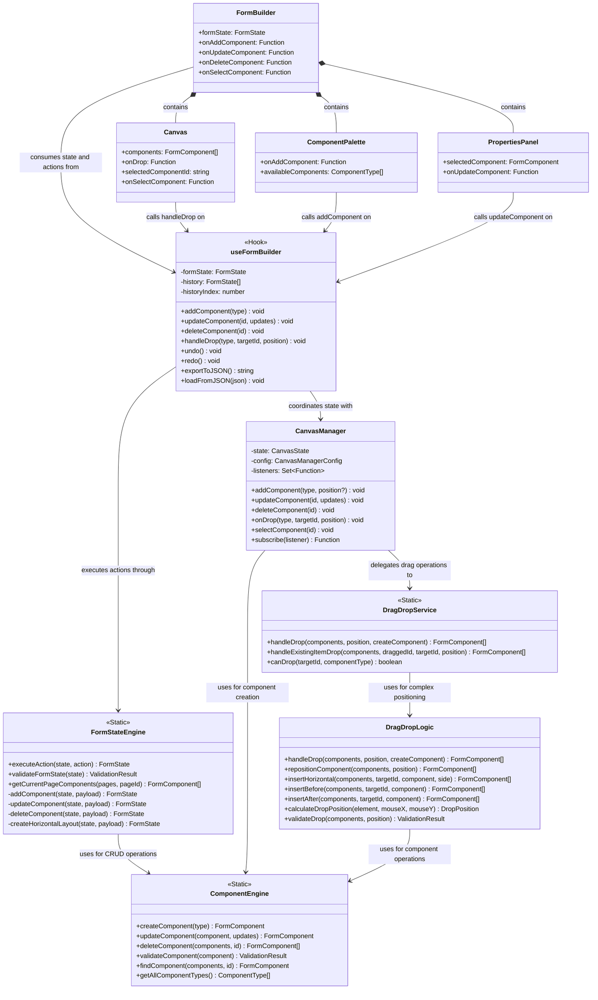
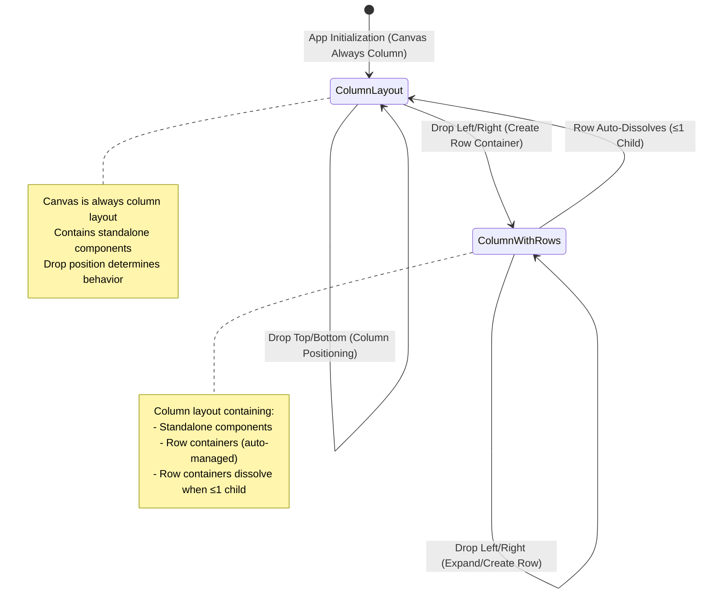
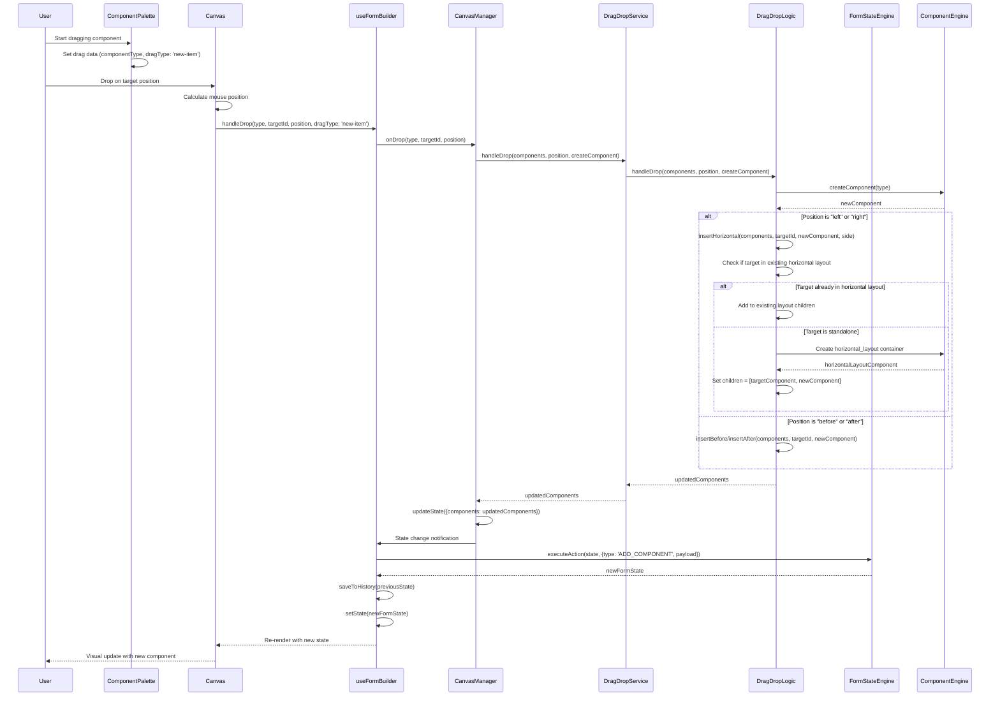
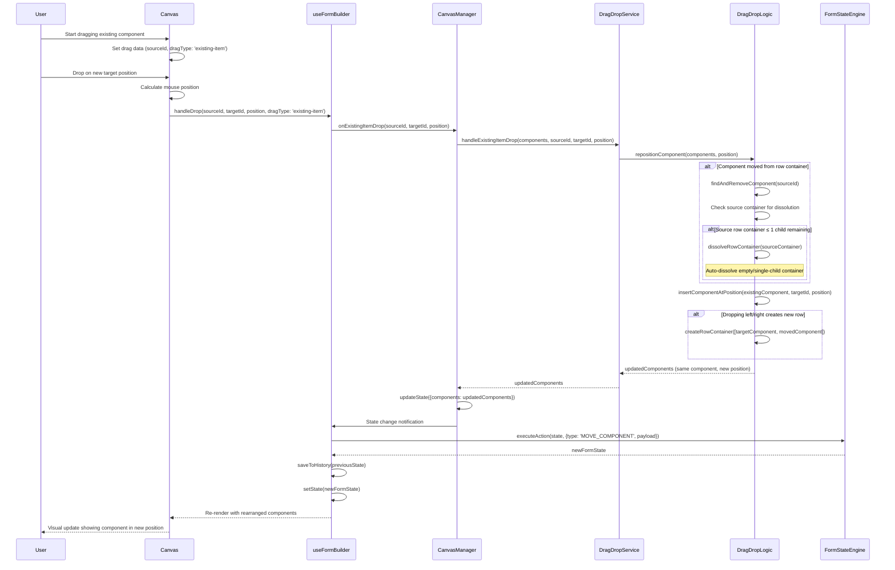
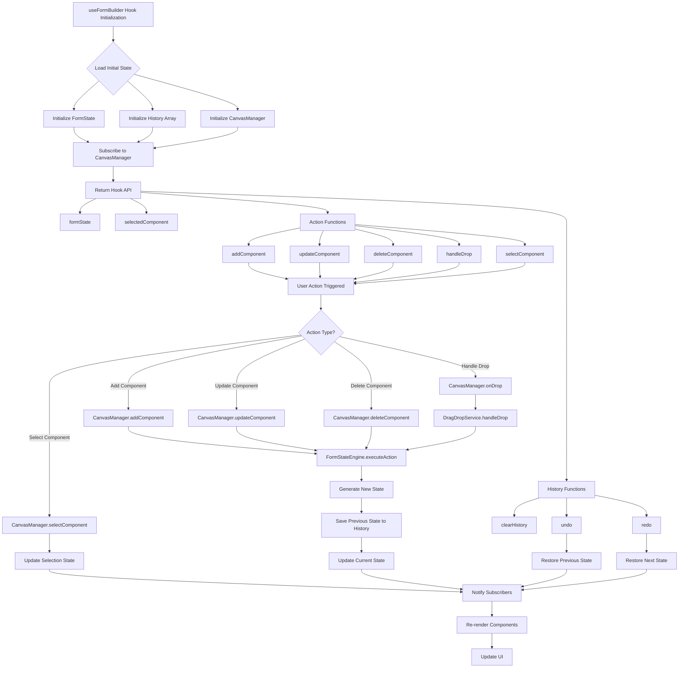
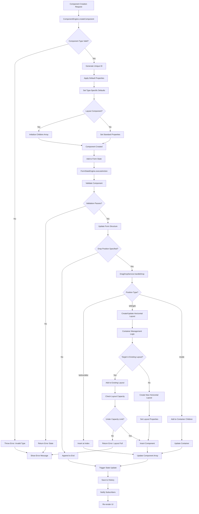
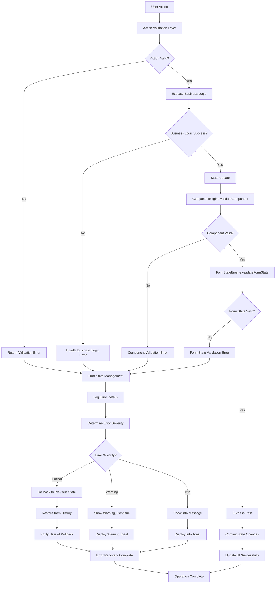
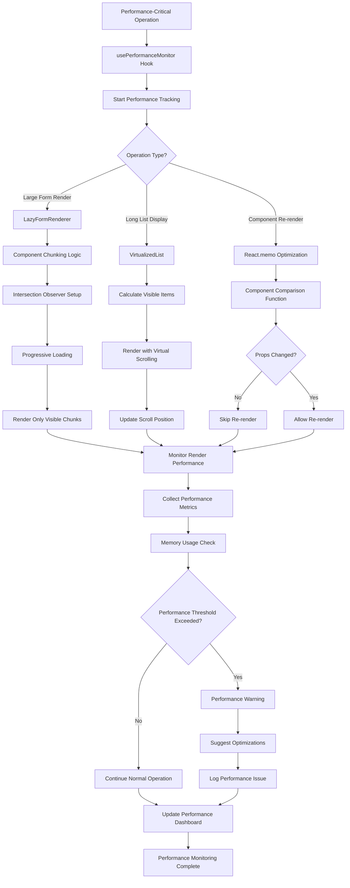

# System Interaction Diagrams

## Overview

This document provides comprehensive diagrams showing how all classes, business logic, hooks, and systems interact to create the complex form builder functionality.

## Class Interaction Diagram



## Simple Drop Position State Flow



## Drag-Drop Operation Sequence Diagram



## Canvas Rearrangement Sequence Diagram (Existing Component Movement)



## Hook Integration Flow Chart



## Component Lifecycle Flow



## Complex Layout Transformation Flow

```mermaid
flowchart TD
    A[Layout Transformation Trigger] --> B{Current Layout State?}
    
    B -->|Empty Canvas| C[Create First Component]
    B -->|Single Component| D[Two-Element Choice Point]
    B -->|Two Components| E[Expansion Decision]
    B -->|Complex Layout| F[Advanced Transformation]
    
    C --> G[Place in Column Layout]
    G --> H[Set Available Drop Zones: Top/Bottom]
    
    D --> I{Drop Position?}
    I -->|Top/Bottom| J[Maintain Column Layout]
    I -->|Left/Right| K[Create Horizontal Layout]
    
    J --> L[Add Component to Array]
    L --> M[Two Vertical Components]
    
    K --> N[ComponentEngine.createComponent(horizontal_layout)]
    N --> O[Set Children = [targetComponent, newComponent]]
    O --> P[Replace Target with Layout Container]
    P --> Q[Two Horizontal Components in Container]
    
    E --> R{Expansion Type?}
    R -->|Add to Column| S[Three Vertical Components]
    R -->|Add to Row| T[Three Horizontal Components]
    R -->|Create Mixed| U[Mixed Layout State]
    
    S --> V[Update Drop Zones: All Top/Bottom]
    T --> W[Update Drop Zones: Row Left/Right, Container Top/Bottom]
    U --> X[Context-Dependent Drop Zones]
    
    F --> Y{Complex Operation?}
    Y -->|Extract from Row| Z[Element Extraction Logic]
    Y -->|Dissolve Container| AA[Container Dissolution Logic]
    Y -->|Reorder Elements| BB[Element Reordering Logic]
    
    Z --> CC{Row Size After Extraction?}
    CC -->|Size = 1| DD[Dissolve Row Container]
    CC -->|Size ≥ 2| EE[Preserve Row Container]
    
    DD --> FF[Move Remaining Child to Canvas Level]
    DD --> GG[Delete Empty Container]
    FF --> HH[Two Standalone Components]
    
    EE --> II[Mixed Layout: Standalone + Row]
    
    AA --> JJ[Extract All Children]
    JJ --> KK[Delete Container]
    KK --> LL[Convert to Column Layout]
    
    BB --> MM[Update Array Positions]
    MM --> NN[Maintain Container Structure]
    
    H --> OO[Update Form State]
    M --> OO
    Q --> OO
    V --> OO
    W --> OO
    X --> OO
    HH --> OO
    II --> OO
    LL --> OO
    NN --> OO
    
    OO --> PP[Save State to History]
    PP --> QQ[Trigger Re-render]
    QQ --> RR[Update UI Visually]
```

## Error Handling & Validation Flow



## Performance Optimization Integration



These diagrams show exactly how all the complex systems work together, from the initial user action through the complete business logic flow to the final UI update.