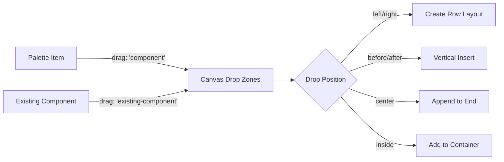

# Canvas Technical Implementation Guide

## 📋 Table of Contents

1. [Architecture Overview](#architecture-overview)
2. [Component Structure](#component-structure)
3. [Drag & Drop System](#drag--drop-system)
4. [Row Layout Management](#row-layout-management)
5. [Test Integration](#test-integration)
6. [Performance Considerations](#performance-considerations)
7. [Extension Points](#extension-points)
8. [Troubleshooting Guide](#troubleshooting-guide)

## 🏗️ Architecture Overview

### High-Level Structure
```
Canvas (Root Container)
├── 📁 Drop Zones
│   ├── SmartDropZone (Regular components)
│   ├── RowLayout (Horizontal layouts)
│   └── BetweenDropZone (Insert zones)
├── 📁 Drag Controls
│   ├── DragHandle components
│   └── Position indicators
└── 📁 Content Rendering
    ├── ComponentContent (Form fields)
    └── ComponentRenderer integration
```

### Key Dependencies
```json
{
  "react": "^18.x",
  "react-dnd": "^16.x",
  "react-dnd-html5-backend": "^16.x",
  "typescript": "^5.x"
}
```

## 🧩 Component Structure

### 1. Main Canvas Component

```typescript
interface CanvasProps {
  components: FormComponentData[];
  onDrop: (componentType: ComponentType, targetId: string, position: 'before' | 'after' | 'left' | 'right' | 'inside') => void;
  onSelect: (componentId: string) => void;
  onDelete: (componentId: string) => void;
  onMove: (dragIndex: number, hoverIndex: number) => void;
  selectedId?: string;
}

export const Canvas: React.FC<CanvasProps> = ({ 
  components, 
  onDrop, 
  onSelect, 
  onDelete,
  onMove,
  selectedId 
}) => {
  // Implementation details...
};
```

**Responsibilities:**
- Root drag-drop container
- Component rendering coordination
- Test helper function exposure
- Empty state management

### 2. SmartDropZone Component

```typescript
interface SmartDropZoneProps {
  component: FormComponentData;
  index: number;
  onDrop: (componentType: ComponentType, targetId: string, position: 'before' | 'after' | 'left' | 'right') => void;
  onSelect: (componentId: string) => void;
  onDelete: (componentId: string) => void;
  onMove: (dragIndex: number, hoverIndex: number) => void;
  selectedId?: string;
}
```

**Key Features:**
- **Position Detection**: 25% left/right zones, 30% top/bottom zones
- **Drag State Management**: Visual feedback during drag operations
- **Drop Handling**: Different logic for new vs existing components
- **Visual Indicators**: Position labels during drag hover

**Position Calculation Algorithm:**
```typescript
const calculateDropPosition = useCallback((clientOffset: { x: number; y: number } | null) => {
  if (!elementRef.current || !clientOffset) return 'center';
  
  const rect = elementRef.current.getBoundingClientRect();
  const x = clientOffset.x - rect.left;
  const y = clientOffset.y - rect.top;
  const width = rect.width;
  const height = rect.height;
  
  // Priority: Horizontal zones first
  if (x < width * 0.25) return 'left';
  if (x > width * 0.75) return 'right';
  
  // Then vertical zones in remaining middle area
  if (y < height * 0.3) return 'before';
  if (y > height * 0.7) return 'after';
  
  return 'center';
}, []);
```

### 3. RowLayout Component

```typescript
interface RowLayoutProps {
  component: FormComponentData;
  index: number;
  onDrop: (componentType: ComponentType, targetId: string, position: 'before' | 'after' | 'left' | 'right' | 'inside') => void;
  onSelect: (componentId: string) => void;
  onDelete: (componentId: string) => void;
  onMove: (dragIndex: number, hoverIndex: number) => void;
  selectedId?: string;
}
```

**Features:**
- **Container Management**: Horizontal arrangement of child components
- **Child Rendering**: Uses RowItemDragZone for internal items
- **Drop Zone**: Accepts new components for insertion
- **Visual Header**: Shows item count and layout type

### 4. ComponentContent Rendering

```typescript
const ComponentContent: React.FC<{ component: FormComponentData }> = ({ component }) => {
  const htmlContent = ComponentRenderer.renderComponent(component, 'builder');
  
  return (
    <div 
      className="form-component__content"
      dangerouslySetInnerHTML={{ __html: htmlContent }}
    />
  );
};
```

**Current Approach:**
- Uses ComponentRenderer from core system
- Renders HTML string via dangerouslySetInnerHTML
- Mode: 'builder' for readonly form preview

## 🎯 Drag & Drop System

### DnD Architecture



### Drag Item Types

```typescript
interface DragItem {
  type: ComponentType;
  id?: string;
  isFromContainer?: boolean;
  containerPath?: string;
  index?: number;
  componentType?: ComponentType;
}
```

**Two Main Flows:**

1. **New Component from Palette:**
   ```typescript
   // Drag item from ComponentPalette
   {
     type: 'text_input',        // ComponentType
     componentType: undefined   // Not set for palette items
   }
   ```

2. **Existing Component Reorder:**
   ```typescript
   // Drag item from existing Canvas component
   {
     type: 'existing-component',
     componentType: 'text_input',
     id: 'component-123',
     index: 2
   }
   ```

### Drop Handling Logic

```typescript
// In SmartDropZone drop handler
if (item.type === 'existing-component' && typeof item.index === 'number') {
  // Handle reordering existing components
  const dragIndex = item.index;
  const hoverIndex = index;
  
  if (dragIndex !== hoverIndex) {
    // Only vertical reordering for existing components
    onMove(dragIndex, targetIndex);
  }
} else {
  // Handle new components from palette
  const position = calculateDropPosition(clientOffset);
  const componentType = item.componentType || item.type;
  
  if (position === 'left' || position === 'right') {
    // Create horizontal layout
    onDrop(componentType, component.id, position);
  } else {
    // Regular insertion
    onDrop(componentType, component.id, position);
  }
}
```

## 🏗️ Row Layout Management

### Creation Process

1. **Trigger**: Drop new component on left/right zones (25% width)
2. **Action**: `onDrop(componentType, targetId, 'left' | 'right')`
3. **Handler**: FormStateEngine → DragDropService → INSERT_HORIZONTAL_LAYOUT
4. **Result**: Replace target component with horizontal_layout containing both

```typescript
// In FormStateEngine
private static insertHorizontalLayout(state: any, payload: { componentType: string; targetId: string; side?: 'left' | 'right' }) {
  const targetIndex = currentPage.components.findIndex((c: FormComponentData) => c.id === payload.targetId);
  const targetComponent = currentPage.components[targetIndex];
  const newComponent = ComponentEngine.createComponent(payload.componentType as any);
  
  // Create horizontal layout
  const horizontalLayout = ComponentEngine.createComponent('horizontal_layout');
  
  if (payload.side === 'left') {
    horizontalLayout.children = [newComponent, targetComponent];
  } else {
    horizontalLayout.children = [targetComponent, newComponent];
  }

  const updatedComponents = [...currentPage.components];
  updatedComponents[targetIndex] = horizontalLayout;
  
  return { ...state, pages: updatedPages };
}
```

### Dissolution Process

1. **Trigger**: Delete component from row layout with only 2 children
2. **Logic**: ComponentEngine.removeComponent detects single child
3. **Action**: Replace row layout with remaining child
4. **Result**: Flat structure restored

```typescript
// In ComponentEngine.removeComponent
if (component.type === 'horizontal_layout' && updatedChildren.length === 1) {
  console.log('🔄 Dissolving row layout with single child:', component.id);
  return updatedChildren[0]; // Replace layout with child
}
```

### Test ID Strategy

```typescript
// Regular canvas items
data-testid="canvas-item-${index}"

// Row layout container  
data-testid="row-layout"

// Items inside row layout
data-testid="row-item-${index}"
```

**Why This Matters:**
- `getCanvasElements()` only counts `canvas-item-*`
- Items inside row layouts don't count as "canvas elements"
- Enables proper test assertions for layout creation

## 🧪 Test Integration

### Test Helper Functions

The Canvas exposes test functions to `window` for integration testing:

```typescript
// Legacy functions (for existing tests)
window.__testMoveComponent__ = (sourceIndex: number, targetIndex: number) => void;
window.__testInsertBetweenComponents__ = (type: string, index: number) => void;
window.__testInsertHorizontalToComponent__ = (type: string, targetId: string, side?: 'left' | 'right') => void;
window.__testAddToRowLayout__ = (type: string, rowLayoutId: string) => void;

// New improved API
window.testDragFromPalette = (componentType: string, targetId: string, position?: string) => void;
window.testReorderComponents = (fromIndex: number, toIndex: number) => void;
window.testCreateHorizontalLayout = (componentType: string, targetId: string, side?: 'left' | 'right') => void;
```

### Test Usage Examples

```typescript
// Create horizontal layout
const insertHorizontalToComponent = (window as any).__testInsertHorizontalToComponent__;
insertHorizontalToComponent('email_input', componentId, 'left');

// Verify row layout exists
const rowLayout = screen.getByTestId('row-layout');
expect(rowLayout).toHaveTextContent('Row Layout (2 items)');

// Verify canvas elements count (should be 0 when items are in row layout)
expect(getCanvasElements()).toHaveLength(0);
```

## ⚡ Performance Considerations

### Optimization Strategies

1. **Drag State Management:**
   ```typescript
   // Don't call onMove during hover - causes excessive re-renders
   hover: (item: DragItem, monitor) => {
     // Only set visual feedback, don't trigger state updates
     setDropPosition(position);
     setIsDropTarget(true);
   }
   ```

2. **Position Calculations:**
   ```typescript
   // Memoize position calculation to avoid recalculating on every hover
   const calculateDropPosition = useCallback((clientOffset) => {
     // Calculation logic...
   }, []); // No dependencies = stable reference
   ```

3. **Component Rendering:**
   ```typescript
   // Use React.Fragment to avoid extra DOM nodes
   {components.map((component, index) => (
     <React.Fragment key={component.id}>
       {/* Component rendering */}
     </React.Fragment>
   ))}
   ```

### Memory Management

- **Event Cleanup**: Remove test functions on unmount
- **Ref Management**: Proper cleanup of drag/drop refs
- **State Reset**: Clear drop states when not hovering

```typescript
// Cleanup test functions
return () => {
  if (typeof window !== 'undefined') {
    const windowWithTests = window as any;
    delete windowWithTests.__testMoveComponent__;
    // ... other cleanup
  }
};
```

## 🔧 Extension Points

### 1. Custom Component Rendering

Replace ComponentContent with custom renderer:

```typescript
interface CanvasProps {
  // ... existing props
  renderComponent?: (component: FormComponentData) => React.ReactNode;
}

const Canvas: React.FC<CanvasProps> = ({ renderComponent, ...props }) => {
  const ComponentContent = renderComponent || DefaultComponentContent;
  // ... use ComponentContent in rendering
};
```

### 2. Custom Drop Zones

Extend drop zone types:

```typescript
type ExtendedPosition = 'before' | 'after' | 'left' | 'right' | 'inside' | 'replace' | 'wrap';

interface ExtendedCanvasProps {
  onDrop: (componentType: ComponentType, targetId: string, position: ExtendedPosition) => void;
  supportedPositions?: ExtendedPosition[];
}
```

### 3. Layout Types

Add support for new layout types:

```typescript
// In component rendering logic
{component.type === 'horizontal_layout' ? (
  <RowLayout ... />
) : component.type === 'vertical_layout' ? (
  <ColumnLayout ... />
) : component.type === 'grid_layout' ? (
  <GridLayout ... />
) : (
  <SmartDropZone ... />
)}
```

## 🐛 Troubleshooting Guide

### Common Issues

#### 1. Drag Not Working
**Symptoms:** Components don't respond to drag gestures
**Causes:**
- Missing `react-dnd` context provider
- Incorrect drag item type
- Event propagation issues

**Solutions:**
```typescript
// Ensure DndProvider wraps Canvas
<DndProvider backend={HTML5Backend}>
  <Canvas ... />
</DndProvider>

// Check drag item types match accept types
const [{ isOver }, drop] = useDrop({
  accept: ['component', 'existing-component'], // Must match drag type
  // ...
});
```

#### 2. Row Layout Not Creating
**Symptoms:** Horizontal drops create vertical layout instead
**Causes:**
- Position calculation not detecting left/right zones
- Drop handler not routing to horizontal creation

**Debug:**
```typescript
// Add logging to position calculation
const position = calculateDropPosition(clientOffset);
console.log('Drop position calculated:', { position, clientOffset, elementRect });
```

#### 3. Test Failures
**Symptoms:** `getCanvasElements()` returns wrong count
**Causes:**
- Test IDs not properly set
- Row layout items counted as canvas items

**Fix:**
```typescript
// Ensure row items use different test ID
data-testid={`row-item-${index}`} // Not canvas-item-${index}
```

#### 4. Performance Issues
**Symptoms:** Lag during drag operations
**Causes:**
- Excessive re-renders during drag
- Complex position calculations

**Solutions:**
```typescript
// Debounce position updates
const debouncedSetDropPosition = useMemo(
  () => debounce(setDropPosition, 16), // ~60fps
  []
);

// Memoize expensive calculations
const positionZones = useMemo(() => ({
  leftZone: width * 0.25,
  rightZone: width * 0.75,
  // ...
}), [width, height]);
```

### Debug Tools

```typescript
// Add to Canvas component for debugging
useEffect(() => {
  if (process.env.NODE_ENV === 'development') {
    window.debugCanvas = {
      components,
      selectedId,
      logState: () => console.table(components.map(c => ({ id: c.id, type: c.type, label: c.label })))
    };
  }
}, [components, selectedId]);
```

## 📚 Additional Resources

- [React DnD Documentation](https://react-dnd.github.io/react-dnd/)
- [Canvas Refactoring Conversation](./CANVAS_REFACTORING_CONVERSATION.md)
- [TypeScript Best Practices](./MODULARITY_GUIDE.md)
- [Testing Strategy Guide](../src/__tests__/README.md)