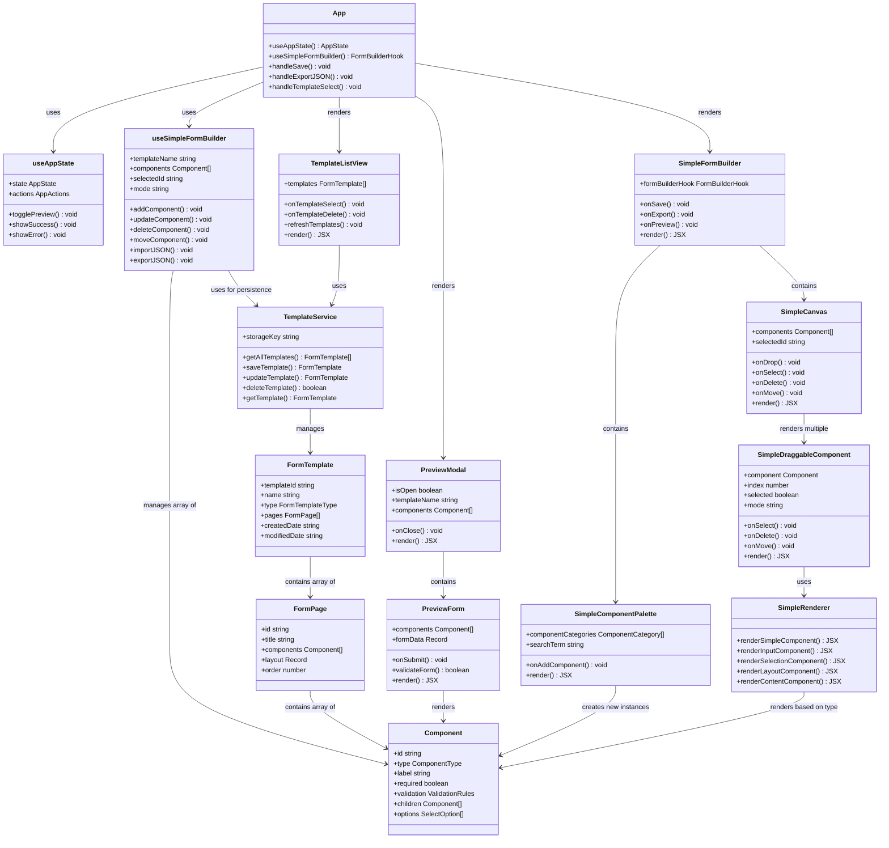

# Class Diagram & System Architecture

## 🏗️ Simplified Architecture Overview

The current system uses a **simplified component-based architecture** that replaced the previous complex engine-based system.

## 📊 Class Diagram (Mermaid)



## 🔄 Component Relationships

### **1. Application Layer**
```
App (Root Component)
├── Manages global state via useAppState
├── Manages form state via useSimpleFormBuilder  
├── Orchestrates component interactions
└── Handles high-level operations (save, export, preview)
```

### **2. State Management Layer**
```
useAppState
├── View management (templates vs builder)
├── Modal state (success, error, preview)
├── Navigation and UI state

useSimpleFormBuilder  
├── Form component management
├── Template name and metadata
├── Component CRUD operations
├── JSON import/export
├── History management (undo/redo)
└── Mode management (create/edit)
```

### **3. UI Component Hierarchy**
```
SimpleFormBuilder (Main Container)
├── Header (title input, action buttons)
├── SimpleComponentPalette (left sidebar)
│   ├── Search functionality
│   ├── Component categories
│   └── Draggable component items
├── SimpleCanvas (center area)
│   ├── Drop zone for new components
│   ├── SimpleDraggableComponent (each form component)
│   │   ├── Component rendering via SimpleRenderer
│   │   ├── Selection controls
│   │   ├── Delete functionality  
│   │   └── Drag handles for reordering
│   └── Empty state when no components
└── Inline preview during palette drag
```

### **4. Template Management System**
```
TemplateListView
├── Template cards with preview
├── Action buttons (Edit/Delete)
├── Real-time refresh (2-second interval)
└── Template selection handling

TemplateService
├── localStorage abstraction
├── CRUD operations for templates
├── JSON serialization/deserialization
└── Error handling and validation
```

### **5. Preview System**
```
PreviewModal (Modal wrapper)
└── PreviewForm (Interactive form)
    ├── Form data management
    ├── Validation handling
    ├── Component rendering via SimpleRenderer
    └── Submission simulation
```

## 📈 Component Interaction Patterns

### **Drag-and-Drop Flow**
1. **SimpleComponentPalette** creates draggable items
2. **SimpleCanvas** acts as drop target
3. **useSimpleFormBuilder** manages state updates
4. **SimpleDraggableComponent** handles reordering
5. **SimpleRenderer** provides consistent rendering

### **Template Operations Flow**
1. **TemplateListView** displays available templates
2. **User interaction** triggers template selection
3. **App component** loads template via useSimpleFormBuilder
4. **SimpleFormBuilder** switches to edit mode
5. **Auto-save** persists changes via TemplateService

### **State Synchronization**
- **Unidirectional data flow** from hooks to components
- **Event propagation** up through callback props
- **Centralized state** in custom hooks
- **Minimal prop drilling** through component tree

## 🔧 Architectural Benefits

### **Simplicity Over Complexity**
- **Single Component interface** replaces 15+ complex types
- **Direct state management** via React hooks
- **Simplified drag-drop** without complex position calculations
- **Clear separation** between UI and business logic

### **Maintainability**
- **Small, focused components** with single responsibilities
- **Clear interfaces** between layers
- **Minimal dependencies** between components
- **Easy to test** and modify individual parts

### **Performance**
- **Efficient re-rendering** through proper memoization
- **Lazy loading** of heavy components
- **Debounced operations** for auto-save and search
- **Optimized drag operations** with minimal state updates

## 🏷️ Key Design Patterns

### **1. Hook-Based State Management**
Custom hooks encapsulate business logic and provide clean APIs to components.

### **2. Render Props Pattern**
Components receive rendering logic through props, enabling flexible composition.

### **3. Compound Component Pattern**
Related components work together (SimpleFormBuilder + SimpleCanvas + SimpleComponentPalette).

### **4. Observer Pattern**
State changes trigger re-renders only in affected components.

### **5. Factory Pattern**
Component creation centralized in utility functions based on component type.

---

*This simplified architecture prioritizes developer experience and maintainability while providing all necessary functionality for form building.*