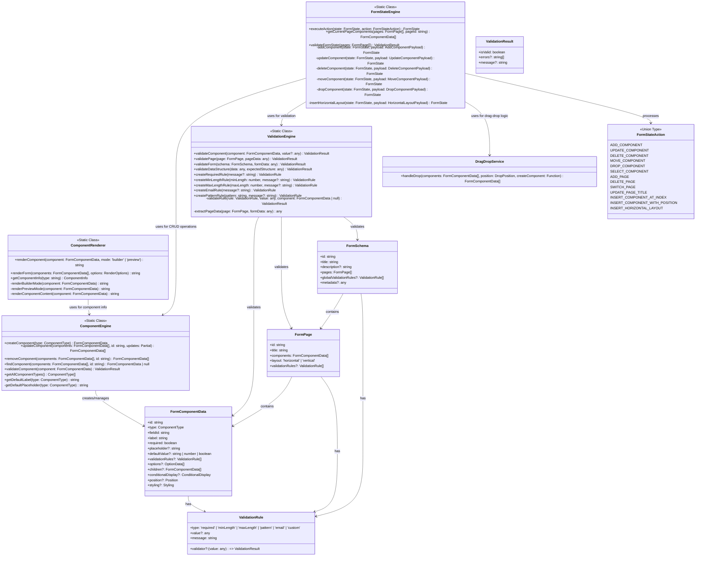
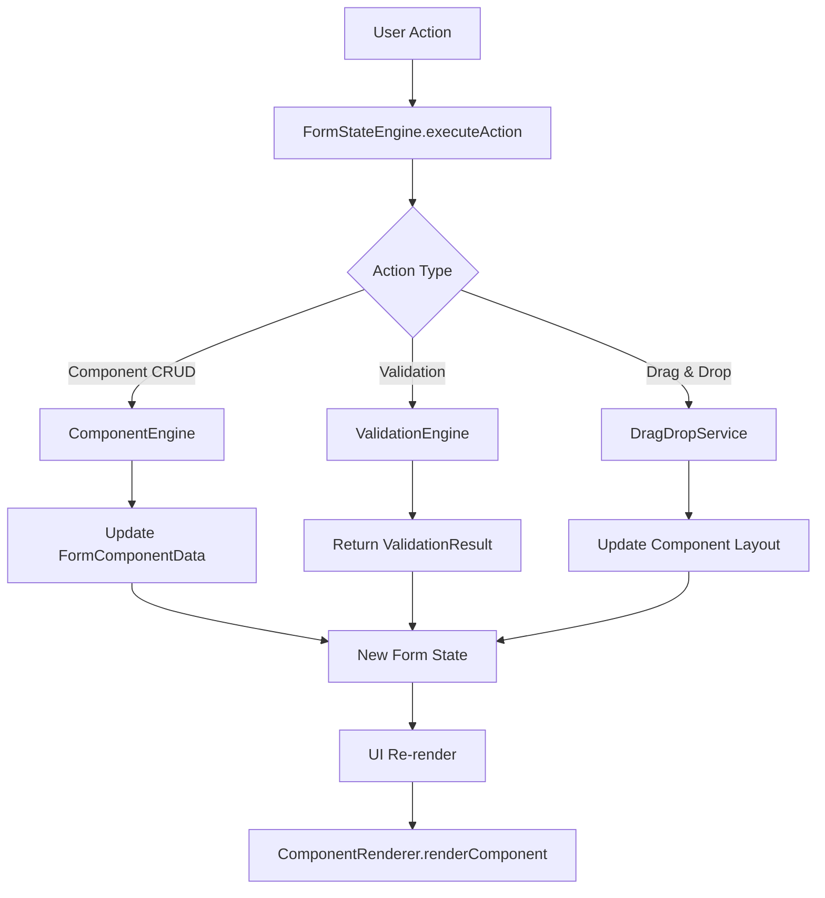

# Form Builder Core Architecture

## Overview

The Form Builder core architecture consists of four main engines that work together to provide a complete form building and management system. Each engine has a single responsibility and communicates through well-defined interfaces.

## Core Architecture Class Diagram



## Architecture Principles

### Single Responsibility Principle
- **ComponentEngine**: Handles all component CRUD operations and basic validation
- **ComponentRenderer**: Handles all component rendering (builder and preview modes)
- **FormStateEngine**: Manages all form state changes and orchestrates operations
- **ValidationEngine**: Handles multi-level validation (field, page, form, schema)

### Data Flow



## Component Type Architecture

### Layout Components
- **horizontal_layout**: Data model for horizontal layouts
- **vertical_layout**: Data model for vertical layouts

### UI Components  
- **RowLayout**: React component that renders horizontal_layout data with `data-testid="row-layout"`
- **VerticalLayout**: React component that renders vertical_layout data
- **HorizontalLayout**: Generic React component for horizontal layouts

**Note**: `horizontal_layout` and `row_layout` are the same concept - `horizontal_layout` is the data type, `RowLayout` is the React component that renders it. Similarly, `vertical_layout` and `column_layout` refer to the same concept.

## Integration Points

### State Management
```typescript
// FormStateEngine orchestrates all operations
const newState = FormStateEngine.executeAction(currentState, {
  type: 'ADD_COMPONENT',
  payload: { componentType: 'text_input', pageId: 'page1' }
});
```

### Component Operations
```typescript
// ComponentEngine handles component lifecycle
const component = ComponentEngine.createComponent('text_input');
const updated = ComponentEngine.updateComponent(components, id, updates);
const validation = ComponentEngine.validateComponent(component);
```

### Rendering
```typescript
// ComponentRenderer handles all rendering
const builderHTML = ComponentRenderer.renderComponent(component, 'builder');
const previewHTML = ComponentRenderer.renderComponent(component, 'preview');
```

### Validation
```typescript
// ValidationEngine handles multi-level validation
const fieldResult = ValidationEngine.validateComponent(component, value);
const pageResult = ValidationEngine.validatePage(page, pageData);
const formResult = ValidationEngine.validateForm(schema, formData);
```

## Key Features

1. **Centralized Operations**: All component operations go through single engines
2. **Type Safety**: Strong TypeScript interfaces for all data structures
3. **Multi-Level Validation**: Field → Page → Form → Schema validation levels
4. **Immutable State**: All operations return new state objects
5. **Separation of Concerns**: Clear boundaries between engines
6. **Extensible**: Easy to add new component types and validation rules
7. **Test-Friendly**: Static methods make testing straightforward
