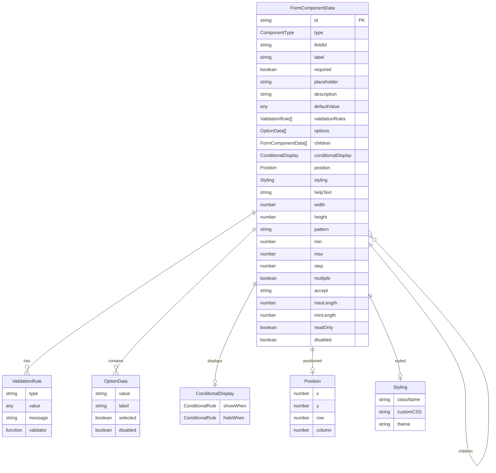
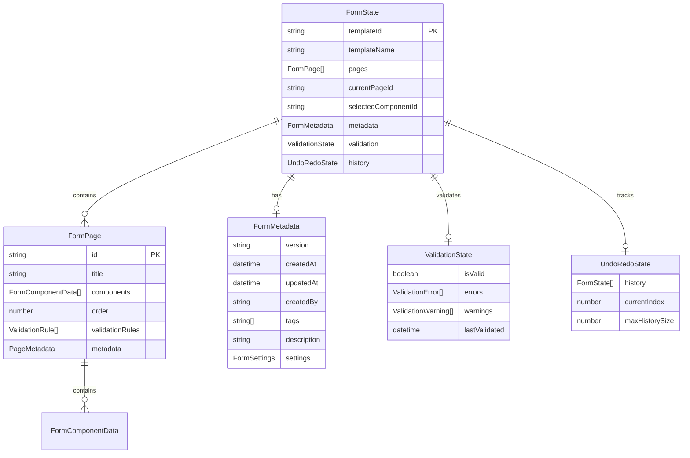
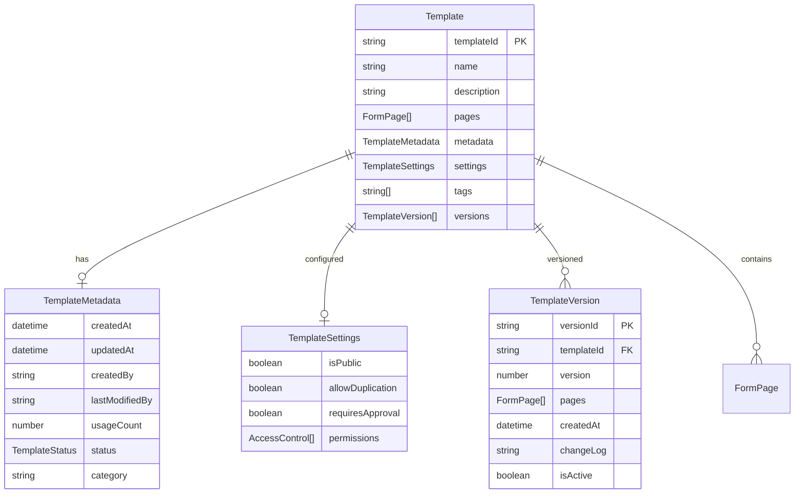
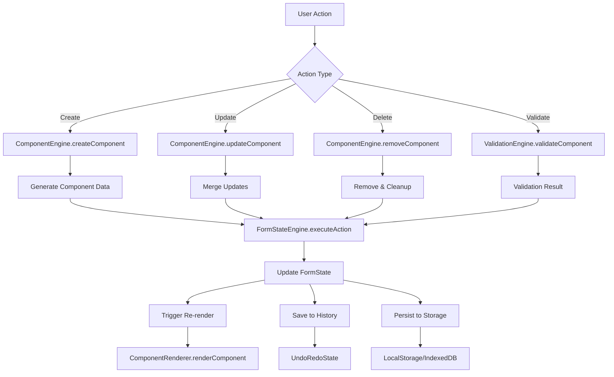
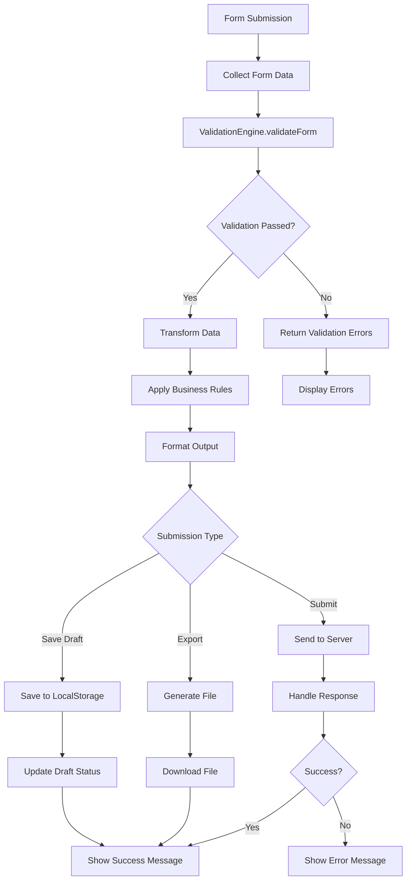
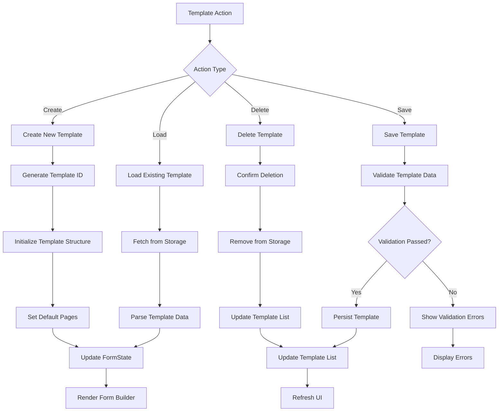
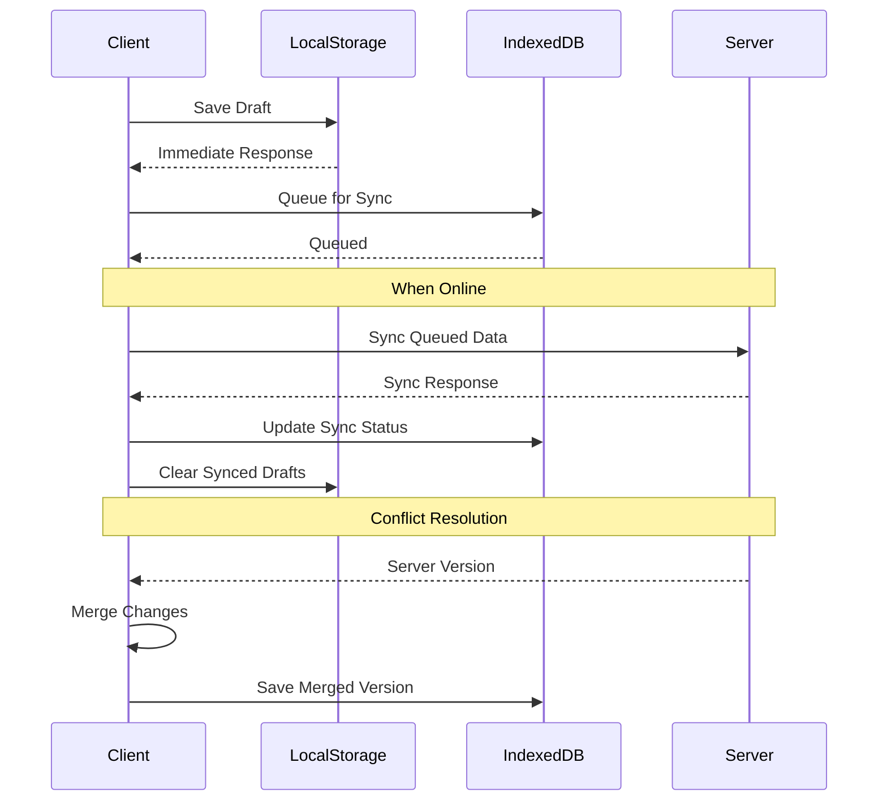

# Form Builder Data Architecture

## Overview

This document outlines the comprehensive data architecture for the Form Builder system, including data models, flow patterns, persistence strategies, and validation rules.

## Core Data Models

### 1. Form Component Data Structure



### 2. Form State Architecture



### 3. Template Management Schema



## Data Flow Architecture

### 1. Component Lifecycle Data Flow



### 2. Form Submission Data Flow



### 3. Template Management Data Flow



## Data Persistence Strategy

### 1. Storage Layers

```typescript
interface StorageLayer {
  // Browser Storage (Offline-First)
  localStorage: {
    drafts: FormDraft[];
    preferences: UserPreferences;
    cache: TemplateCache;
  };
  
  // IndexedDB (Structured Data)
  indexedDB: {
    templates: Template[];
    formData: FormSubmission[];
    history: FormStateHistory[];
    analytics: UsageAnalytics[];
  };
  
  // Server Storage (Sync & Backup)
  serverAPI: {
    templates: Template[];
    submissions: FormSubmission[];
    users: UserProfile[];
    analytics: SystemAnalytics[];
  };
}
```

### 2. Data Synchronization



### 3. Data Validation Rules

```typescript
interface DataValidationRules {
  component: {
    required: ['id', 'type', 'fieldId', 'label'];
    constraints: {
      id: /^[a-zA-Z0-9_-]+$/;
      type: ComponentType[];
      fieldId: /^[a-zA-Z][a-zA-Z0-9_]*$/;
      label: { minLength: 1, maxLength: 100 };
    };
  };
  
  form: {
    required: ['templateId', 'templateName', 'pages'];
    constraints: {
      templateName: { minLength: 1, maxLength: 255 };
      pages: { minItems: 1, maxItems: 50 };
    };
  };
  
  template: {
    required: ['templateId', 'name', 'pages'];
    constraints: {
      name: { minLength: 1, maxLength: 255 };
      pages: { minItems: 1, maxItems: 50 };
      components: { maxDepth: 5, maxPerPage: 100 };
    };
  };
}
```

## Data Transformation Patterns

### 1. Component Data Transformation

```typescript
// Raw Component Data → Normalized Component
interface ComponentTransformer {
  normalize(raw: any): FormComponentData;
  denormalize(component: FormComponentData): any;
  validate(component: FormComponentData): ValidationResult;
  sanitize(component: FormComponentData): FormComponentData;
}

// Layout-Specific Transformations
interface LayoutTransformer {
  flattenLayout(components: FormComponentData[]): FormComponentData[];
  nestLayout(components: FormComponentData[]): FormComponentData[];
  optimizeLayout(components: FormComponentData[]): FormComponentData[];
}
```

### 2. Form Data Export/Import

```typescript
interface FormDataTransformer {
  // Export Formats
  toJSON(formState: FormState): string;
  toXML(formState: FormState): string;
  toCSV(submissions: FormSubmission[]): string;
  toPDF(formState: FormState): Blob;
  
  // Import Formats
  fromJSON(json: string): FormState;
  fromXML(xml: string): FormState;
  fromCSV(csv: string): FormSubmission[];
  
  // Migration
  migrateVersion(data: any, fromVersion: string, toVersion: string): FormState;
}
```

### 3. Submission Data Processing

```typescript
interface SubmissionProcessor {
  collect(formState: FormState, formElement: HTMLFormElement): FormSubmission;
  validate(submission: FormSubmission, schema: FormState): ValidationResult;
  transform(submission: FormSubmission, rules: TransformationRule[]): any;
  format(submission: FormSubmission, format: OutputFormat): string | Blob;
}
```

## Performance Optimization

### 1. Data Caching Strategy

```typescript
interface CacheStrategy {
  // Component-Level Caching
  componentCache: Map<string, RenderedComponent>;
  
  // Page-Level Caching
  pageCache: Map<string, RenderedPage>;
  
  // Template-Level Caching
  templateCache: Map<string, Template>;
  
  // Validation Cache
  validationCache: Map<string, ValidationResult>;
}
```

### 2. Lazy Loading Patterns

```typescript
interface LazyLoadingStrategy {
  // Component Lazy Loading
  loadComponent(type: ComponentType): Promise<ComponentDefinition>;
  
  // Template Lazy Loading
  loadTemplate(templateId: string): Promise<Template>;
  
  // Page Lazy Loading
  loadPage(pageId: string): Promise<FormPage>;
  
  // Asset Lazy Loading
  loadAssets(componentTypes: ComponentType[]): Promise<AssetBundle>;
}
```

### 3. Data Compression

```typescript
interface CompressionStrategy {
  // Template Compression
  compressTemplate(template: Template): CompressedTemplate;
  decompressTemplate(compressed: CompressedTemplate): Template;
  
  // Form Data Compression
  compressFormData(formData: FormSubmission[]): CompressedFormData;
  decompressFormData(compressed: CompressedFormData): FormSubmission[];
}
```

## Security & Privacy

### 1. Data Encryption

```typescript
interface EncryptionStrategy {
  // Client-Side Encryption
  encryptSensitiveData(data: any, key: string): EncryptedData;
  decryptSensitiveData(encrypted: EncryptedData, key: string): any;
  
  // Field-Level Encryption
  encryptField(fieldValue: any, fieldConfig: FieldConfig): EncryptedField;
  decryptField(encrypted: EncryptedField, fieldConfig: FieldConfig): any;
}
```

### 2. Access Control

```typescript
interface AccessControlStrategy {
  // Template Access
  canAccessTemplate(userId: string, templateId: string): boolean;
  canEditTemplate(userId: string, templateId: string): boolean;
  
  // Form Data Access
  canViewSubmission(userId: string, submissionId: string): boolean;
  canExportData(userId: string, templateId: string): boolean;
}
```

### 3. Data Anonymization

```typescript
interface AnonymizationStrategy {
  // PII Removal
  removePII(submission: FormSubmission): AnonymizedSubmission;
  
  // Data Masking
  maskSensitiveFields(data: any, maskingRules: MaskingRule[]): any;
  
  // Aggregation
  aggregateData(submissions: FormSubmission[]): AggregatedData;
}
```

## Analytics & Reporting

### 1. Usage Analytics

```typescript
interface UsageAnalytics {
  // Component Usage
  componentUsage: Map<ComponentType, UsageStats>;
  
  // Template Performance
  templateMetrics: Map<string, TemplateMetrics>;
  
  // User Behavior
  userInteractions: InteractionEvent[];
  
  // Form Completion
  completionRates: CompletionStats[];
}
```

### 2. Performance Metrics

```typescript
interface PerformanceMetrics {
  // Render Performance
  renderTimes: Map<string, number>;
  
  // Validation Performance
  validationTimes: Map<string, number>;
  
  // Storage Performance
  storageOperations: StorageMetric[];
  
  // Network Performance
  networkRequests: NetworkMetric[];
}
```

This comprehensive data architecture provides a robust foundation for the Form Builder system, ensuring scalability, performance, and maintainability while supporting complex form building scenarios and data management requirements.
