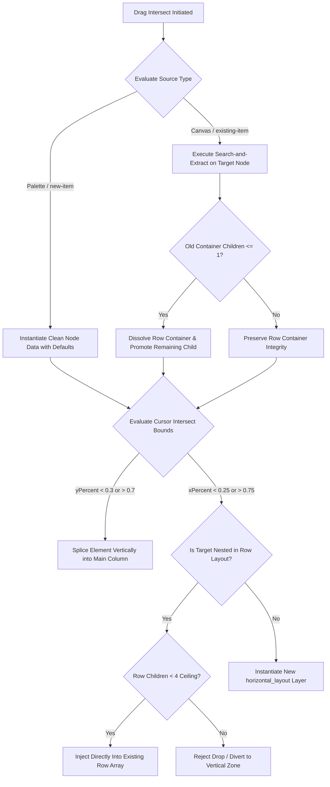

# Unified Form Builder Application

**PRD ID**: PRD-2026-06-22-0835
**Status**: Draft
**Complexity**: High
**Created**: June 22, 2026
**Author**: Si Thu Hlaing

---

## Problem

Healthcare and business analysts need a way to rapidly create, prototype, and export structured questionnaire schemas without depending on direct software developer resource allocation. Overly complex and abstracted layout engines in legacy tools create friction, making it difficult for non-technical stakeholders to build predictable and compliant form structures.

## Solution

We will build an interactive drag-and-drop web form builder that runs on a clean React component-state architecture via the `useSimpleFormBuilder` hook. The layout uses a defactorized, auto-managed horizontal and vertical container model. By checking cursor placement coordinate thresholds relative to active components, the canvas dynamically handles vertical insertions and side-by-side row generation. The layout styling will strictly conform to the NHS UK Frontend typography guidelines and status color tokens.

## Summary

An interactive drag-and-drop form builder built with React, TypeScript, and Tailwind CSS. The app features state-driven layout structures, multi-column row limits, live component parameter editing, multi-page page matrices, and Firestore JSON persistence. (This section is completed after implementation is complete.)

---

## Scope

### In Scope

- **Template Index Views**: saved form schemas fetched directly from template library storage.
- **Search & Filters**: client-side metadata and title queries.
- **Interactive Drag-and-Drop**: palette item insertions and existing element rearrangements on the canvas.
- **Auto-Dissolution Layouts**: auto-dissolves rows to standalone vertical components when element count falls to $\le 1$.
- **4-Field Ceiling Constraint**: limits horizontal rows to a maximum of 4 side-by-side elements.
- **Dynamic Properties Panel**: context-aware configurations for component labels, placeholders, option arrays, and validation flags.
- **Multi-page Layouts**: sub-page instantiation, tabs selector, and deletion routines.
- **Import/Export Pipeline**: Master Save serialized directly to Firestore, schema file uploads, and JSON exports.
- **End-User Preview Mode**: clean user-facing form rendering masking builder elements.

### Out of Scope

- Remote transaction execution
- Persistent target database ingestion pipelines
- Dynamic conditional path mapping
- User permission/role access schemas

### Target Users

| Role | Impact |
| ---- | ------ |
| Business Analysts | Can rapidly prototype, view, and output compliant clinical form schemas without writing code. |
| Domain Managers | Define NHS standard components and lay out collection steps easily via a clean visual editor. |

---

## Technical Design

### Architecture



### Database Changes

| Table | Change | Reason |
| ----- | ------ | ------ |
| templates | Modify | Extend template model attributes to support layout pages, fields mapping, and NHS style definitions |

### Backend

| Component | Changes |
| --------- | ------- |
| Controllers | Add endpoints to list, retrieve, create, delete, and import JSON template schemas |
| Services | Create Firestore template parsing service and JSON schema validator |
| Models | Extend Template scheme models validating form properties (title, pages, fields metadata, options list) |
| Routes | Mount `/api/v1/templates` routes |

### Frontend

| Component  | Changes |
| ---------- | ------- |
| Pages      | Create home template selector page and the visual layout builder editor page |
| Components | Build LeftPanel (palette), Canvas, and RightPanel (properties editor) incorporating NHS styling patterns |
| Types      | Define FormNode, FormComponent, RowContainer, and page-layout types |

---

## Implementation

### Phase 1: Foundation & Template Navigation Matrices

- [ ] **1.1 Template Display Engine**: Set up the core index dashboard to show saved form schemas fetched straight from the storage database.
- [ ] **1.2 Template Search Query Filter**: Implement client-side title filter checks to scan form metadata names dynamically without forcing component refreshes.
- [ ] **1.3 Clean Builder Inception**: Bind the "Create New Form" action link to invoke complete clear-down routines, formatting state items to baseline defaults.
- [ ] **1.4 Persisted Entry Mapping**: Wire the template index "Edit" interaction to extract selected JSON layers and hydrate canvas contexts inside edit viewports.
- [ ] **1.5 Target Schema Deletion**: Connect the index delete component to call slice operations targeting specific keys inside local file caches.

### Phase 2: Canvas Drop Calculations & Real-time Visual Refinement

- [ ] **2.1 Empty Canvas Blueprint View**: Build out empty-state canvas wrappers showing helpful file instruction prompts when component arrays evaluate to empty lengths.
- [ ] **2.2 Palette Insertion Engine**: Map left-panel collection entries as valid drag components to instantiate elements with clean types.
- [ ] **2.3 Side-Drop Horizontal Engine**: Implement intersecting side-box coordinate checks to intercept side drops and produce horizontal container components on the fly.
- [ ] **2.4 Multi-Column Field Constraints**: Introduce checking algorithms within row layouts to enforce a maximum capacity constraint of 4 horizontal children.
- [ ] **2.5 Vertical Stack Routing**: Configure standard cursor vertical hits to splice input fields seamlessly above or below active sibling fields.
- [ ] **2.6 Auto-Dissolution Layout Cleanup**: Add validation passes inside canvas removal triggers to strip structural rows whenever active child items drop down to single occupants.

### Phase 3: Context-Aware Properties, Page Matrices, & High-Fidelity Previews

- [ ] **3.1 Dynamic Node Inspection**: Set up canvas event hooks to sync selected component identifiers directly with properties panel controllers.
- [ ] **3.2 Shared Component Configurations**: Construct parameter fields inside property views allowing immediate updates to string labels and prompt indicators.
- [ ] **3.3 Option List Splice Arrays**: Build an editable text field layer for select, checkbox, and radio elements that splits raw string inputs by newline markers into choice options.
- [ ] **3.4 Mandatory Validation Toggles**: Implement dynamic Boolean controls inside field property views to attach validation flags to item properties.
- [ ] **4.1 Dynamic Page Insertion**: Provide clean controls at the bottom of the viewport to instantiate fresh sub-pages matching empty component structures.
- [ ] **4.2 Page Selection Index Switching**: Connect layout tab items to re-route state variables, loading targeted sub-arrays onto the building canvas.
- [ ] **4.3 Multi-Step Page Deletion**: Structure a deletion interface for layout pages that includes checking conditions to block multi-page state deletion operations.
- [ ] **5.1 Workspace Sidebar Toggles**: Integrate toggle buttons on canvas edge boundaries to minimize side menu states for widescreen form editing.
- [ ] **5.2 Master Save Pipeline**: Wire the header save action to compile form page states and serialize them directly into Firestore persistence matrices.
- [ ] **5.3 Automated JSON Export**: Build file download utility paths that package structural layouts into standalone JSON files.
- [ ] **5.4 Automated Schema Ingestion**: Write input parsing tools inside the header interface to safely de-serialize imported layout files.
- [ ] **5.5 End-User Form Preview View**: Construct an high-fidelity preview mode component that safely masks builder tools, rendering fields inside a clean user-facing test view.

---

## Security

| Concern | Mitigation |
| ------- | ---------- |
| Authorization | Custom token validation and route guards preventing unauthenticated template manipulation |
| Input validation | Zod parsing on API request payloads and validation schemas on custom client fields |
| Data exposure | Strip database primary keys and analytical metrics from serialisation before JSON exports |

---

## Testing

**Automated:**

```bash
npm run test
```

**Manual Verification:**

1. Navigate to the dashboard workspace, select "Create New Form", select components from Left Palette, and drop them on the canvas.
2. Arrange components vertically and horizontally. Check that dropping a component next to another creates a `horizontal_layout` row and that removing components auto-dissolves it once elements count falls to $\le 1$.
3. Toggle "Preview Mode" and verify all components mask builder selectors and render using NHS styles.

---

## Risks

| Risk | Likelihood | Mitigation |
| ---- | ---------- | ---------- |
| Drag & Drop coordinate mismatch in custom browser scales | Med | Use normalized viewport relative bounding boxes via `getBoundingClientRect` and cross-browser automation tests |
| Concurrent template modifications | Low | Lock updates with optimistic concurrency checks using database document version numbers |

---

## Definition of Done

- [ ] Implementation complete
- [ ] Tests passing
- [ ] Security verified
- [ ] Lint / type checks clean
- [ ] PR approved and merged

---

## Files Changed

| Category | Files | Description |
| -------- | ----- | ----------- |
| Backend  | `src/app/api/templates/route.ts` | Backend Firestore endpoints |
| Frontend | `src/App.tsx`, `src/app/components/canvas.tsx` | Main workspace dashboard, canvas interaction |
| Database | `prisma/schema.prisma` | PostgreSQL/Firestore Template schemas |
| Tests    | `src/components/__tests__/drag-drop.test.tsx` | Unit and layout integration tests |

---

## Related

- **Issues**: #101
- **PRs**: #102
- **Docs**: [NHS UK Frontend Design System](https://service-manual.nhs.uk/design-system)

---

_Last updated: June 22, 2026_
