# Sequence Diagrams - User Interaction Flows

## 🔄 Core User Workflows

This document illustrates the key user interaction flows in the form builder system using sequence diagrams.

## 📊 Sequence Diagrams (Mermaid)

### **1. Form Building - Adding Components from Palette**

### **2. Template Management - Saving and Loading**

```mermaid
sequenceDiagram
    participant U as User
    participant FB as SimpleFormBuilder
    participant App as App
    participant H as useSimpleFormBuilder
    participant S as TemplateService
    participant TL as TemplateListView
    participant LS as localStorage

    Note over U,LS: User creates form and saves as template

    U->>FB: Click "💾 Save" button
    FB->>App: Call onSave()
    App->>App: handleSave()
    
    App->>H: Get current state (templateName, components)
    App->>S: saveTemplate(templateData)
    S->>S: Generate unique templateId
    S->>S: Create FormTemplate object
    S->>LS: Store template in localStorage['formTemplates']
    S-->>App: Return saved template
    
    App->>App: Switch to edit mode
    App->>App: Show success modal
    
    Note over U,LS: User later loads the template
    
    U->>TL: Click template card "Edit" button  
    TL->>App: Call onTemplateSelect(template)
    App->>App: handleTemplateSelect()
    
    App->>H: importJSON(templateData)
    H->>H: Parse JSON and update state
    H->>H: Set templateName and components
    H->>H: Set mode to 'edit'
    
    H-->>FB: State change triggers re-render
    FB-->>U: Form builder shows loaded template
```

### **3. Component Reordering Within Canvas**

### **4. Form Preview Flow**

```mermaid
sequenceDiagram
    participant U as User
    participant FB as SimpleFormBuilder
    participant App as App
    participant AS as useAppState
    participant PM as PreviewModal
    participant PF as PreviewForm
    participant SR as SimpleRenderer

    Note over U,SR: User previews their form

    U->>FB: Click "👁️ Preview" button
    FB->>App: Call onPreview()
    App->>AS: togglePreview(true)
    AS->>AS: Set showPreview = true
    
    AS-->>App: State change triggers re-render
    App->>PM: Render PreviewModal (isOpen=true)
    PM->>PF: Render PreviewForm with components
    
    PF->>PF: Initialize form data state
    PF->>SR: Render each component
    SR->>SR: Generate interactive form elements
    SR-->>PF: Return rendered components
    PF-->>PM: Display interactive form
    PM-->>U: Show modal with form preview

    Note over U,SR: User interacts with preview form
    
    U->>PF: Fill out form fields
    PF->>PF: Update form data state
    PF->>PF: Run validation on fields
    
    U->>PF: Click "Submit" button
    PF->>PM: Show submission results modal
    
    U->>PM: Click "Close" or X button
    PM->>App: Call onClose()
    App->>AS: togglePreview(false)
    AS-->>App: Hide modal
```

### **5. Template List Management**

### **6. Auto-Save Mechanism**

### **7. Error Handling Flow**

## 🎯 Key Interaction Patterns

### **1. Unidirectional Data Flow**
- All state changes flow down from hooks to components
- User actions flow up through callback props
- No direct component-to-component communication

### **2. Event-Driven Architecture**  
- User interactions trigger state changes
- State changes trigger re-renders
- Side effects (auto-save) triggered by state changes

### **3. Optimistic Updates**
- UI updates immediately on user actions
- Background persistence handles failures gracefully
- Rollback mechanisms for failed operations

### **4. Debounced Operations**
- Auto-save waits 1 second for additional changes
- Search operations debounced for performance
- Batch multiple rapid state updates

### **5. Error Boundaries**
- Component-level error handling with user feedback
- Application-level error boundaries for stability
- Graceful degradation when operations fail

---

*These sequence diagrams illustrate the clean, predictable flow of data and user interactions throughout the simplified form builder architecture.*