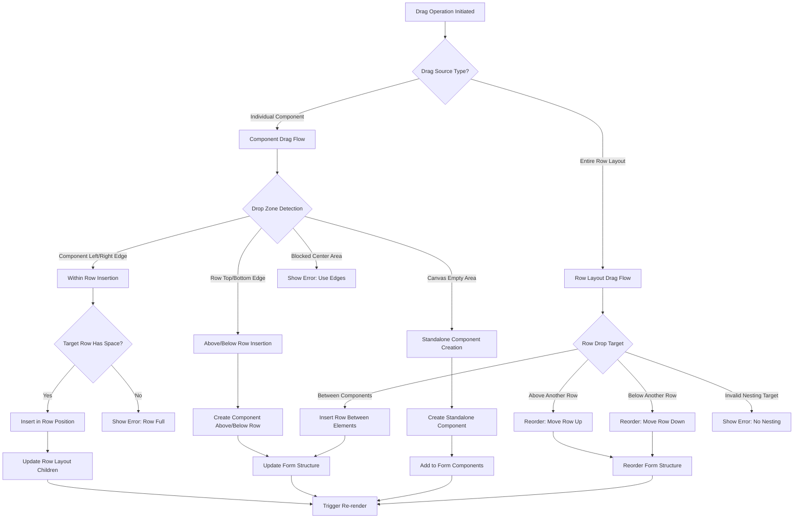

# Side-by-Side Arrangement Business Logic

## Overview

The side-by-side arrangement system manages horizontal layout of form components within the canvas. This document defines the core business logic for creating, managing, and expanding horizontal row layouts.

## Core Principles

### 1. Dynamic Layout Transformation System
The form builder automatically transitions between **Column Layout** (default/vertical) and **Row Layout** (horizontal) based on element count and arrangement patterns:

- **Default Mode**: Column Layout (vertical arrangement, top-to-bottom)
- **Horizontal Mode**: Row Layout (side-by-side arrangement, left-to-right)  
- **Automatic Container Management**: Containers are created/dissolved based on element positioning

### 2. Layout State Transitions

#### State 1: Empty Canvas (Default Column Mode)
```
Canvas (Column Layout - Default Mode)
├── [Empty] - Only top/bottom drop zones available
```

#### State 2: Single Element (Column Mode)
```  
Canvas (Column Layout)
├── Component A - Available: Top, Bottom
```

#### State 3: Two Elements - Choice Point
**Option 3A: Vertical Arrangement (Column Layout)**
```
Canvas (Column Layout)  
├── Component A - Available: Top, Bottom
└── Component B - Available: Top, Bottom
```

**Option 3B: Horizontal Arrangement (Row Layout)**
```
Canvas (Column Layout)
└── Horizontal Layout (Row Container)
    ├── Component A - Available: Left, Right  
    └── Component B - Available: Left, Right
```

#### State 4: Three Elements - Multiple Configurations

**Option 4A: All Vertical (Pure Column Layout)**
```
Canvas (Column Layout)
├── Component A - Available: Top, Bottom
├── Component B - Available: Top, Bottom  
└── Component C - Available: Top, Bottom
```

**Option 4B: Mixed Layout (Column + Row Hybrid)**
```
Canvas (Column Layout)
├── Component A - Available: Top, Bottom (standalone)
└── Horizontal Layout (Row Container) - Available: Top, Bottom (as unit)
    ├── Component B - Available: Left, Right
    └── Component C - Available: Left, Right
```

**Option 4C: All Horizontal (Single Row Layout)**
```
Canvas (Column Layout)
└── Horizontal Layout (Row Container) - Available: Top, Bottom (as unit)
    ├── Component A - Available: Left, Right
    ├── Component B - Available: Left, Right
    └── Component C - Available: Left, Right
```

### 3. Container Lifecycle Management
- **Auto-Creation**: Row containers created when 2+ elements arranged side-by-side
- **Auto-Expansion**: Row containers expand to accommodate up to 4 elements
- **Auto-Dissolution**: Row containers dissolve when reduced to 1 element
- **Auto-Preservation**: Column layout (default mode) always maintained at canvas level

## Business Logic Rules

### Rule 1: Hierarchical Drop Zone Priority
**Scope**: Determines which drop zone takes precedence when multiple zones overlap

```typescript
enum DropZonePriority {
  COMPONENT_LEVEL = 1,    // Highest priority: Left/Right of individual components
  ROW_LAYOUT_LEVEL = 2,   // Medium priority: Top/Bottom of entire row
  CANVAS_LEVEL = 3        // Lowest priority: Canvas empty areas
}
```

**Priority Resolution Logic**:
1. **Component Level First**: If cursor is in left/right edge of component within row → Insert within row
2. **Row Level Second**: If cursor is in top/bottom edge of row → Insert above/below entire row
3. **Canvas Level Last**: If cursor is in empty canvas area → Create new standalone component

### Rule 2: Row Layout Dragging Rules
**Scenario**: Dragging an entire horizontal layout to reposition it

```typescript
// Before: 
// [Component A]
// [Row Layout [Component B, Component C]]
// [Component D]

// Action: Drag Row Layout above Component A
// After:
// [Row Layout [Component B, Component C]]
// [Component A] 
// [Component D]
```

**Implementation Logic**:
1. Detect drag initiation from row layout drag handle
2. Treat entire row layout as single draggable unit
3. Maintain all child components within row during drag
4. Allow vertical repositioning only (no horizontal splitting)
5. Update form structure while preserving row integrity

### Rule 3: Blocked Drop Zones
**Scenario**: Preventing invalid drop operations within row layouts

```typescript
interface BlockedDropZones {
  // Inside row layout - center areas of components
  componentCenterAreas: {
    blocked: true;
    reason: "Use left/right edges for horizontal insertion";
    alternative: "Drop above/below row for vertical insertion";
  };
  
  // Row layout interior (not component edges)
  rowInteriorAreas: {
    blocked: true;
    reason: "Cannot insert into middle of row layout";  
    alternative: "Use component left/right edges or row top/bottom edges";
  };
  
  // Nested row layouts
  nestedRowLayouts: {
    blocked: true;
    reason: "Row layouts cannot be nested inside other rows";
    alternative: "Drop above/below existing row to create separate row";
  };
}
```

### Rule 4: Initial Side-by-Side Creation
**Scenario**: Dragging component to the left/right of an existing standalone component

```typescript
// Before: [Component A]
// Action: Drag Component B to right of Component A
// After: [Horizontal Layout [Component A, Component B]]
```

**Implementation Logic**:
1. Detect drop position as `left` or `right`
2. Create new `horizontal_layout` container
3. Move target component into layout as first child
4. Add new component as second child (position based on `left`/`right`)
5. Replace original component with new horizontal layout

### Rule 2: Progressive Row Expansion  
**Scenario**: Dragging component to left/right of component already in horizontal layout

```typescript
// Before: [Horizontal Layout [Component A, Component B]]
// Action: Drag Component C to right of Component B
// After: [Horizontal Layout [Component A, Component B, Component C]]
```

**Implementation Logic**:
1. Detect that target component is within existing horizontal layout
2. Find target component's position within layout children
3. Insert new component at calculated index based on drop side
4. Validate row doesn't exceed maximum capacity (default: 4 components)

### Rule 3: Row Capacity Management
**Constraints**:
- **Maximum Components per Row**: 4 components (configurable)
- **Minimum Components per Row**: 2 components
- **Auto-dissolution**: Rows with only 1 component automatically dissolve back to standalone

```typescript
interface HorizontalLayoutConfig {
  maxComponentsPerRow: number;     // Default: 4
  minComponentsPerRow: number;     // Default: 2  
  autoDissolveEmptyRows: boolean;  // Default: true
}
```

### Rule 4: Row Dissolution Logic
**Scenarios for Row Dissolution**:

1. **Single Component Remaining**: When row has only 1 component left after deletion
```typescript
// Before: [Horizontal Layout [Component A]]
// After: [Component A] (standalone)
```

2. **Empty Row**: When all components are removed from row
```typescript
// Before: [Horizontal Layout []]
// After: [] (layout removed entirely)
```

## Drop Zone Behavior

### Hierarchical Drop Zone System

The system implements **nested drop zone behavior** with different rules for individual components vs. row layouts:

#### Level 1: Individual Component Drop Zones (Within Row Layout)
**Scope**: Components inside a horizontal layout
**Available Positions**: Left and Right only

| Drop Position | Visual Indicator | Result |
|---------------|------------------|--------|
| **Left Edge** | Blue line on left side of component | Insert to left within same row |
| **Right Edge** | Blue line on right side of component | Insert to right within same row |
| **Center Area** | No drop allowed | Blocked - use left/right edges |

#### Level 2: Row Layout Drop Zones (Entire Row)
**Scope**: The horizontal layout container as a whole unit
**Available Positions**: Top and Bottom only

| Drop Position | Visual Indicator | Result |
|---------------|------------------|--------|
| **Top Edge** | Horizontal blue line above entire row | Insert new component/row above this row |
| **Bottom Edge** | Horizontal blue line below entire row | Insert new component/row below this row |
| **Row Interior** | No drop allowed for external components | Internal left/right positioning only |

### Nested Drop Zone Detection Logic

```typescript
interface HierarchicalDropZoneDetection {
  // Level 1: Individual Component Zones (within row layout)
  componentLevel: {
    leftZone: { start: 0, end: 0.2 };      // Left 20% triggers left insertion
    rightZone: { start: 0.8, end: 1.0 };   // Right 20% triggers right insertion
    blockedCenter: { start: 0.2, end: 0.8 }; // Center 60% blocked for external drops
  };
  
  // Level 2: Row Layout Zones (entire horizontal layout)
  rowLayoutLevel: {
    topZone: { start: 0, end: 0.15 };       // Top 15% triggers insert above row
    bottomZone: { start: 0.85, end: 1.0 };  // Bottom 15% triggers insert below row
    interiorZone: { start: 0.15, end: 0.85 }; // Interior delegates to component level
  };
  
  // Level 3: Canvas Level (between row layouts)
  canvasLevel: {
    betweenRowsZone: true;                   // Gaps between row layouts allow insertion
    canvasEmptyArea: true;                   // Empty canvas areas allow direct insertion
  };
}
```

### Row Layout Dragging Behavior

#### Drag Handle System
**Row Layout as Single Unit**: Entire horizontal layouts can be dragged and repositioned

```typescript
interface RowLayoutDragBehavior {
  // Drag initiation
  dragHandle: {
    location: 'top-left-corner' | 'left-border' | 'drag-icon';
    visual: 'grip-dots' | 'drag-handle-icon';
    cursor: 'move' | 'grab';
  };
  
  // Drag feedback
  dragFeedback: {
    rowHighlight: boolean;        // Highlight entire row during drag
    ghostPreview: boolean;        // Show ghost image of entire row
    dropZonePreview: boolean;     // Show valid drop zones
  };
  
  // Drop validation
  dropValidation: {
    allowRowReordering: boolean;  // Can reorder rows vertically
    allowRowNesting: boolean;     // Can nest rows (false by default)
    preserveRowIntegrity: boolean; // Keep all child components together
  };
}
```

## Component Data Structure

### Horizontal Layout Component Schema
```typescript
interface HorizontalLayoutComponent extends FormComponentData {
  type: 'horizontal_layout';
  id: string;                    // Unique layout identifier
  fieldId: string;              // Not used for data collection
  label: string;                // "Row Layout" (not displayed)
  children: FormComponentData[]; // Array of 2-4 child components
  
  // Layout-specific properties
  layoutConfig: {
    distribution: 'equal' | 'auto' | 'custom';  // Width distribution
    spacing: 'tight' | 'normal' | 'loose';      // Inter-component spacing
    alignment: 'top' | 'center' | 'bottom';     // Vertical alignment
    wrapBehavior: 'nowrap' | 'wrap';            // Responsive behavior
  };
}
```

### Child Component Constraints
- **Width Distribution**: Components within horizontal layout share available width
- **Responsive Behavior**: On small screens, horizontal layouts can wrap to vertical stacks
- **Validation Independence**: Each child component validates independently

## State Management Integration

### FormStateEngine Actions

#### 1. CREATE_HORIZONTAL_LAYOUT
```typescript
{
  type: 'CREATE_HORIZONTAL_LAYOUT',
  payload: {
    targetComponentId: string;     // Component to include in layout
    newComponentType: ComponentType; // Component being added
    insertSide: 'left' | 'right';  // Which side to add new component
  }
}
```

#### 2. ADD_TO_HORIZONTAL_LAYOUT
```typescript
{
  type: 'ADD_TO_HORIZONTAL_LAYOUT', 
  payload: {
    layoutId: string;              // Target horizontal layout
    componentType: ComponentType;   // Component to add
    insertIndex: number;           // Position within layout children
  }
}
```

#### 3. DISSOLVE_HORIZONTAL_LAYOUT
```typescript
{
  type: 'DISSOLVE_HORIZONTAL_LAYOUT',
  payload: {
    layoutId: string;              // Layout to dissolve
    preserveComponents: boolean;   // Keep child components as standalone
  }
}
```

#### 4. MOVE_ROW_LAYOUT
```typescript
{
  type: 'MOVE_ROW_LAYOUT',
  payload: {
    rowLayoutId: string;           // Row layout to move
    targetPosition: {
      type: 'above' | 'below' | 'between';
      targetId: string;            // Target component/row ID
      insertIndex?: number;        // Specific position (for 'between')
    };
    preserveIntegrity: boolean;    // Keep all child components together
  }
}
```

#### 5. REORDER_ROW_LAYOUTS
```typescript
{
  type: 'REORDER_ROW_LAYOUTS',
  payload: {
    sourceRowId: string;           // Row being moved
    targetRowId: string;           // Target row position
    insertPosition: 'above' | 'below';
    formPageId: string;            // Page containing the rows
  }
}
```

## Drag and Drop Flow

### Hierarchical Drag and Drop Flow Diagram



### Row Layout Drag and Drop Specifics

#### 1. Row Layout Drag Initiation
```typescript
interface RowLayoutDragInitiation {
  // Drag handle detection
  dragHandleZones: {
    topLeftCorner: { width: '20px', height: '20px' };
    leftBorder: { width: '8px', height: '100%' };
    dragIcon: { width: '16px', height: '16px' };
  };
  
  // Drag behavior
  dragBehavior: {
    highlightEntireRow: true;        // Visual feedback
    preserveChildComponents: true;   // All children move together
    preventHorizontalDrag: true;     // Only vertical repositioning
    showDropZoneIndicators: true;    // Show valid drop areas
  };
}
```

#### 2. Row Layout Drop Validation
```typescript
interface RowLayoutDropValidation {
  // Valid drop targets for entire row layouts
  validDropTargets: {
    aboveOtherRows: boolean;         // Can drop above other row layouts
    belowOtherRows: boolean;         // Can drop below other row layouts
    betweenStandaloneComponents: boolean; // Can drop between individual components
    emptyCanvasAreas: boolean;       // Can drop in empty canvas space
  };
  
  // Invalid drop targets
  invalidDropTargets: {
    insideOtherRows: boolean;        // Cannot nest rows inside rows
    componentCenterAreas: boolean;   // Cannot drop on component centers
    componentEdgeAreas: boolean;     // Cannot drop on component left/right edges
  };
}
```

### Nested Drop Zone Resolution Algorithm

```typescript
class HierarchicalDropZoneResolver {
  static resolveDropZone(
    mousePosition: { x: number, y: number },
    targetElement: HTMLElement,
    formStructure: FormComponentData[]
  ): DropZoneResult {
    
    // Priority 1: Check component-level zones (left/right edges)
    const componentZone = this.detectComponentEdgeZone(mousePosition, targetElement);
    if (componentZone.detected && componentZone.type === 'edge') {
      return {
        level: 'component',
        action: 'insert_in_row',
        position: componentZone.side, // 'left' | 'right'
        targetId: componentZone.componentId
      };
    }
    
    // Priority 2: Check row-level zones (top/bottom edges)  
    const rowZone = this.detectRowLayoutZone(mousePosition, targetElement);
    if (rowZone.detected && rowZone.type === 'edge') {
      return {
        level: 'row',
        action: 'insert_relative_to_row',
        position: rowZone.side, // 'above' | 'below'
        targetId: rowZone.rowLayoutId
      };
    }
    
    // Priority 3: Check canvas-level zones (empty areas)
    const canvasZone = this.detectCanvasZone(mousePosition, formStructure);
    if (canvasZone.detected) {
      return {
        level: 'canvas',
        action: 'create_standalone',
        position: canvasZone.insertIndex
      };
    }
    
    // Priority 4: Blocked zone
    return {
      level: 'blocked',
      action: 'show_error',
      message: 'Drop not allowed in this area. Use component edges or row edges.'
    };
  }
}
```

## Validation Rules

### Layout Validation
1. **Child Component Limit**: Maximum 4 components per horizontal layout
2. **Minimum Components**: Horizontal layouts must have at least 2 components
3. **Component Type Restrictions**: Some components may be restricted from horizontal layouts:
   - `section_divider`: Generally not allowed in horizontal layouts
   - `rich_text`: May be restricted due to width requirements

### Business Rules Validation
```typescript
interface LayoutValidationRules {
  validateHorizontalLayoutCreation(
    targetComponent: FormComponentData,
    newComponent: FormComponentData
  ): ValidationResult;
  
  validateComponentAddition(
    layout: HorizontalLayoutComponent,
    newComponent: FormComponentData
  ): ValidationResult;
  
  validateLayoutDissolution(
    layout: HorizontalLayoutComponent
  ): ValidationResult;
}
```

## Error Handling

### Common Error Scenarios

1. **Row Capacity Exceeded**
   - **Error**: "Cannot add component: Row already contains maximum number of components (4)"
   - **Resolution**: Suggest creating new row or removing existing component

2. **Invalid Component Type**
   - **Error**: "Component type 'section_divider' cannot be added to horizontal layout"
   - **Resolution**: Show alternative drop zones (above/below)

3. **Layout Dissolution Conflict** 
   - **Error**: "Cannot remove component: Would leave empty horizontal layout"
   - **Resolution**: Auto-dissolve layout and convert remaining components to standalone

## Responsive Behavior

### Mobile/Small Screen Adaptation
```typescript
interface ResponsiveLayoutBehavior {
  breakpoints: {
    mobile: '< 768px';     // Stack vertically
    tablet: '768px - 1024px'; // 2 components per row max  
    desktop: '> 1024px';   // Full horizontal layout (up to 4)
  };
  
  stackingBehavior: {
    mobile: 'vertical_stack';      // All components stack vertically
    tablet: 'two_column_wrap';     // Max 2 components per row with wrapping
    desktop: 'horizontal_layout';   // Full horizontal layout
  };
}
```

## Performance Considerations

### Optimization Strategies
1. **Layout Caching**: Cache horizontal layout calculations
2. **Minimal Re-renders**: Only re-render affected layout components
3. **Batch Operations**: Group multiple layout changes into single state update

### Memory Management
```typescript
interface LayoutPerformanceConfig {
  maxCachedLayouts: number;        // Default: 50
  cacheTTL: number;               // Cache time-to-live in ms
  enableBatchUpdates: boolean;     // Batch multiple layout changes
  enableVirtualization: boolean;   // For forms with many horizontal layouts
}
```

## Integration with Form Processing

### Data Collection Impact
- **Field Mapping**: Child components maintain their individual `fieldId` values
- **Validation Flow**: Each component validates independently, layout provides grouping only
- **Submission Format**: Layout structure is not reflected in submitted data

### JSON Schema Export
```typescript
// Horizontal layout is structural only - not exported to data schema
interface ExportBehavior {
  includeLayoutStructure: boolean;  // Include in template schema
  excludeFromDataSchema: boolean;   // Exclude from validation schema
  preserveFieldOrder: boolean;      // Maintain field order in export
}
```

## API Reference

### Core Methods

```typescript
class HorizontalLayoutManager {
  // Create horizontal layout with two components
  static createHorizontalLayout(
    targetComponent: FormComponentData,
    newComponent: FormComponentData, 
    insertSide: 'left' | 'right'
  ): HorizontalLayoutComponent;
  
  // Add component to existing horizontal layout
  static addToHorizontalLayout(
    layout: HorizontalLayoutComponent,
    component: FormComponentData,
    insertIndex: number
  ): HorizontalLayoutComponent;
  
  // Remove component from horizontal layout
  static removeFromHorizontalLayout(
    layout: HorizontalLayoutComponent,
    componentId: string
  ): HorizontalLayoutComponent | FormComponentData[];
  
  // Dissolve horizontal layout back to standalone components
  static dissolveHorizontalLayout(
    layout: HorizontalLayoutComponent
  ): FormComponentData[];
  
  // Validate horizontal layout operations
  static validateLayoutOperation(
    operation: LayoutOperation,
    context: LayoutContext
  ): ValidationResult;
}
```

This business logic documentation provides comprehensive guidance for implementing and maintaining the side-by-side arrangement system within the form builder architecture.