# Visual Form Builder - Layout Logic Flowcharts

## Document Purpose

This document contains **Mermaid flowcharts** that visually explain all the layout logic from `0003-layout-logic-implementation.md`. Use these diagrams to understand the complete drag-drop system.

**How to view:** Copy the Mermaid code blocks into:
- Mermaid Live Editor: https://mermaid.live
- GitHub (renders automatically)
- VS Code with Mermaid extension
- Any Markdown viewer with Mermaid support

---

## Table of Contents

1. [Master Drag-Drop Flow](#1-master-drag-drop-flow)
2. [Drop Position Detection](#2-drop-position-detection)
3. [Drag Source Detection](#3-drag-source-detection)
4. [Horizontal Layout Creation](#4-horizontal-layout-creation)
5. [Auto-Dissolution Logic](#5-auto-dissolution-logic)
6. [Row Layout Dragging](#6-row-layout-dragging)
7. [Element Count Transitions](#7-element-count-transitions)
8. [Validation System](#8-validation-system)
9. [Complex Mixed Layout Flow](#9-complex-mixed-layout-flow)
10. [Edge Case Handling](#10-edge-case-handling)

---

## 1. Master Drag-Drop Flow

### Complete End-to-End Process

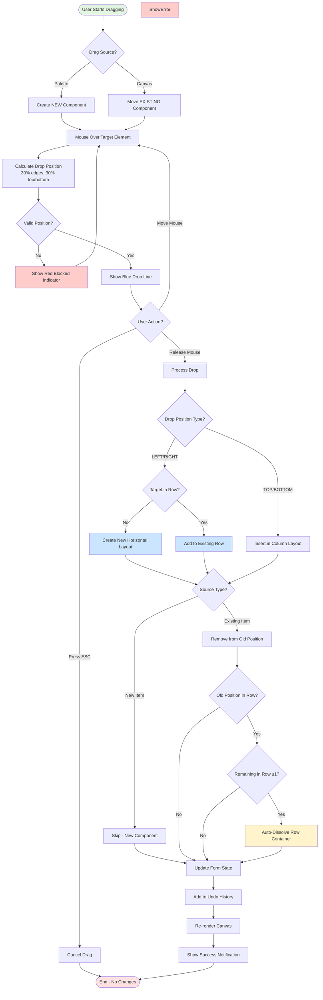

---

## 2. Drop Position Detection

### Position Calculation Algorithm

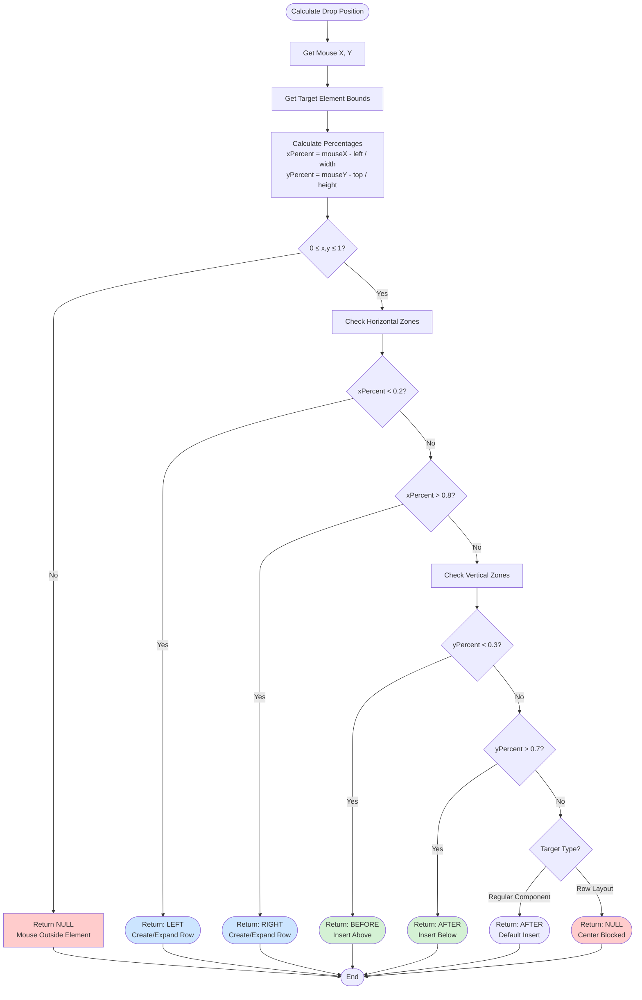

### Visual Zone Map

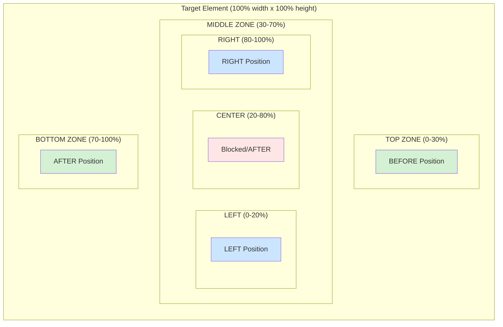

---

## 3. Drag Source Detection

### Palette vs Canvas Logic

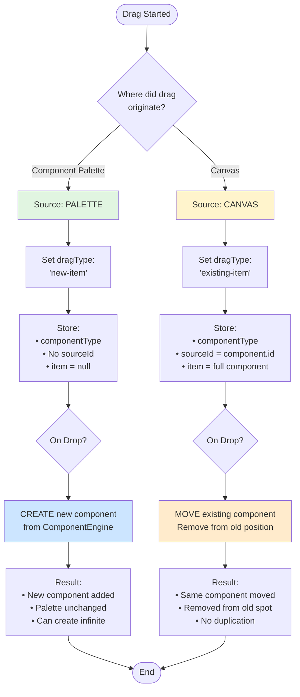

### Comparison Table

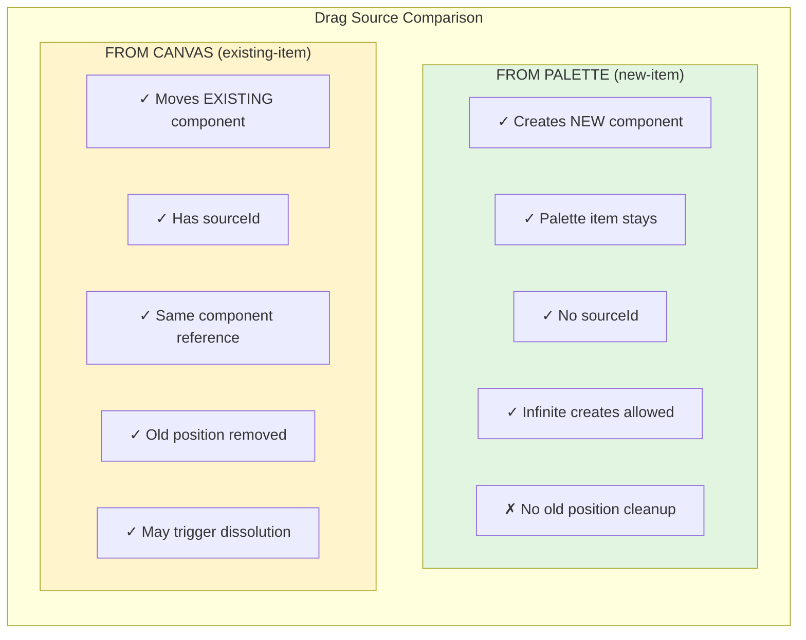

---

## 4. Horizontal Layout Creation

### Main Decision Flow

```mermaid
graph TD
    Start([Drop LEFT or RIGHT]) --> CheckTarget{Is target already<br/>in a row?}
    
    CheckTarget -->|No| CreateNew[CREATE NEW ROW]
    CheckTarget -->|Yes| AddExist[ADD TO EXISTING ROW]
    
    CreateNew --> GetComponents[Get Components:<br/>• Dragged component<br/>• Target component]
    
    GetComponents --> CheckOrder{Drop position?}
    
    CheckOrder -->|LEFT| OrderLeft[Children:<br/>[dragged, target]]
    CheckOrder -->|RIGHT| OrderRight[Children:<br/>[target, dragged]]
    
    OrderLeft --> CreateContainer[Create Row Container]
    OrderRight --> CreateContainer
    
    CreateContainer --> SetProps[Set Properties:<br/>• type: horizontal_layout<br/>• id: row-xxx<br/>• children: 2 components<br/>• capacity: 2/4]
    
    SetProps --> ReplaceTarget[Replace target component<br/>with row container]
    
    ReplaceTarget --> CheckDragType{Drag Type?}
    
    CheckDragType -->|existing-item| RemoveOld[Remove from old position]
    CheckDragType -->|new-item| SkipRemove[Skip removal]
    
    RemoveOld --> Success
    SkipRemove --> Success
    
    AddExist --> FindPos[Find target position<br/>within row children]
    FindPos --> InsertPos{Insert position?}
    
    InsertPos -->|LEFT| InsertBefore[Insert at targetIndex]
    InsertPos -->|RIGHT| InsertAfter[Insert at targetIndex + 1]
    
    InsertBefore --> UpdateRow[Update row.children array]
    InsertAfter --> UpdateRow
    
    UpdateRow --> Success[Add to History<br/>Show notification<br/>Re-render]
    
    Success --> End([End])

    style CreateNew fill:#cce5ff
    style AddExist fill:#b3d9ff
    style Error fill:#ffcccc
    style Success fill:#d4f1d4
```

### Row Creation Example

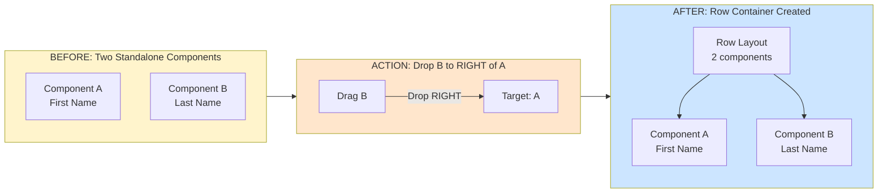

---

## 5. Auto-Dissolution Logic

### Main Dissolution Flow

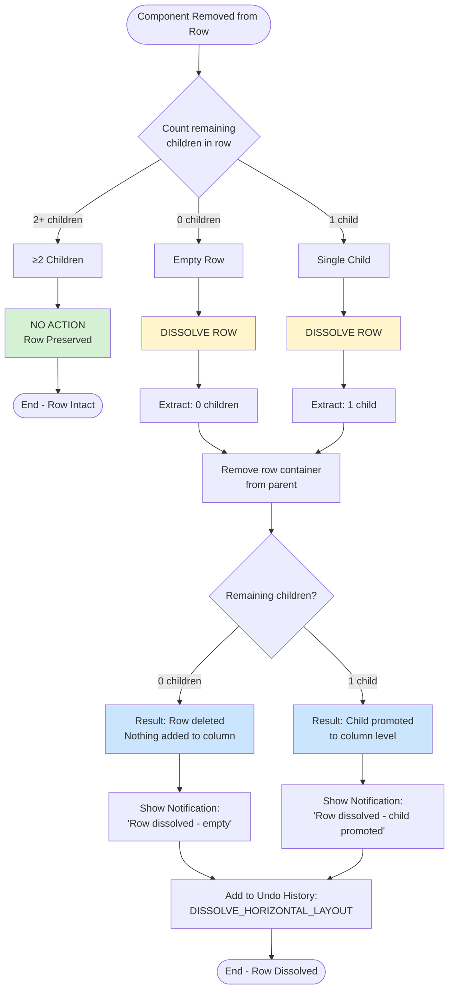

### Dissolution Scenarios

```mermaid
graph TD
    subgraph S1 ["Scenario 1: Delete from 2-Element Row"]
        direction LR
        S1B["BEFORE<br/>Row[A, B]"] -->|Delete B| S1A["AFTER<br/>A (standalone)"]
    end
    
    subgraph S2 ["Scenario 2: Drag Out from 2-Element Row"]
        direction LR
        S2B["BEFORE<br/>Row[A, B]"] -->|Drag B out| S2A["AFTER<br/>A, B (both standalone)"]
    end
    
    subgraph S3 ["Scenario 3: Drag Out from 3-Element Row"]
        direction LR
        S3B["BEFORE<br/>Row[A, B, C]"] -->|Drag C out| S3A["AFTER<br/>Row[A, B] + C (standalone)"]
    end
    
    subgraph S4 ["Scenario 4: Delete from 4-Element Row"]
        direction LR
        S4B["BEFORE<br/>Row[A, B, C, D]"] -->|Delete D| S4A["AFTER<br/>Row[A, B, C] (preserved)"]
    end

    style S1 fill:#ffcccc
    style S2 fill:#ffcccc
    style S3 fill:#d4f1d4
    style S4 fill:#d4f1d4
```

### Dissolution Decision Tree

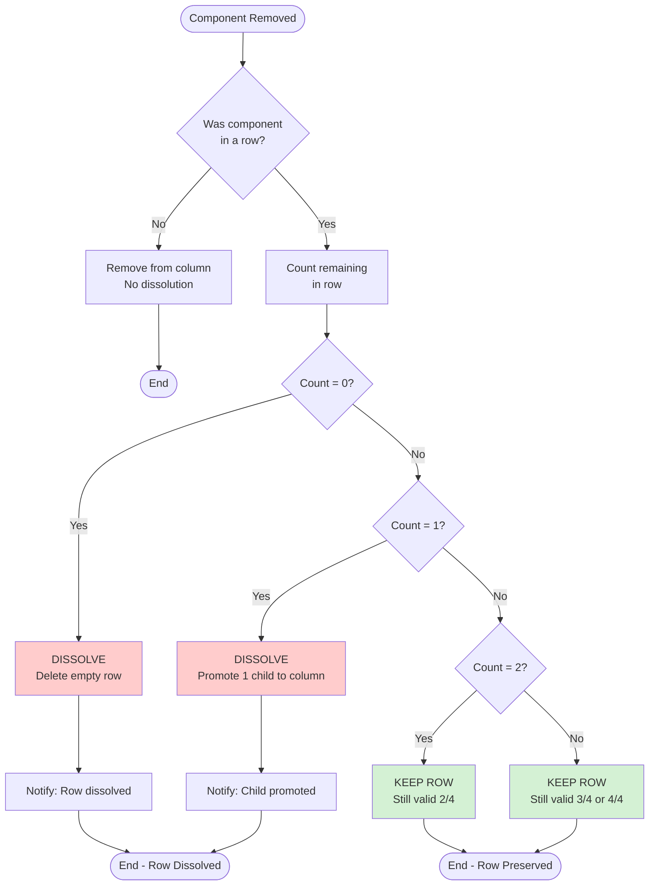

---

## 6. Row Layout Dragging

### Row Drag Validation Flow

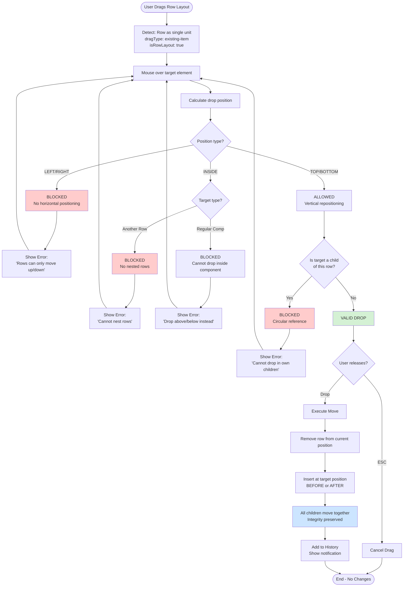

### Row Dragging Constraints

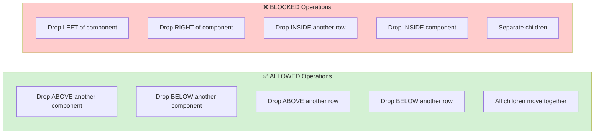

### Row Movement Example

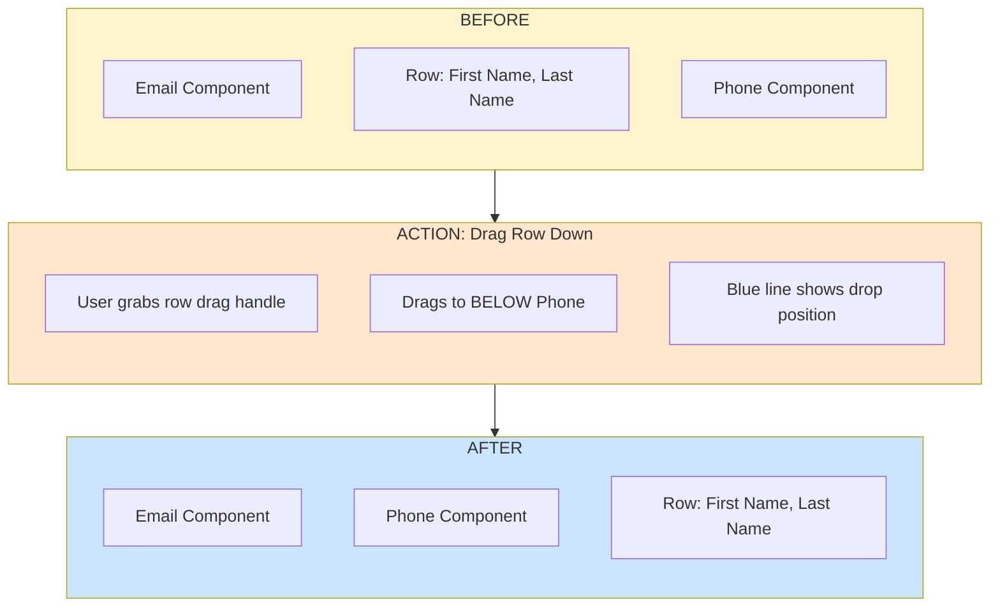

---

## 7. Element Count Transitions

### Complete Transition Map

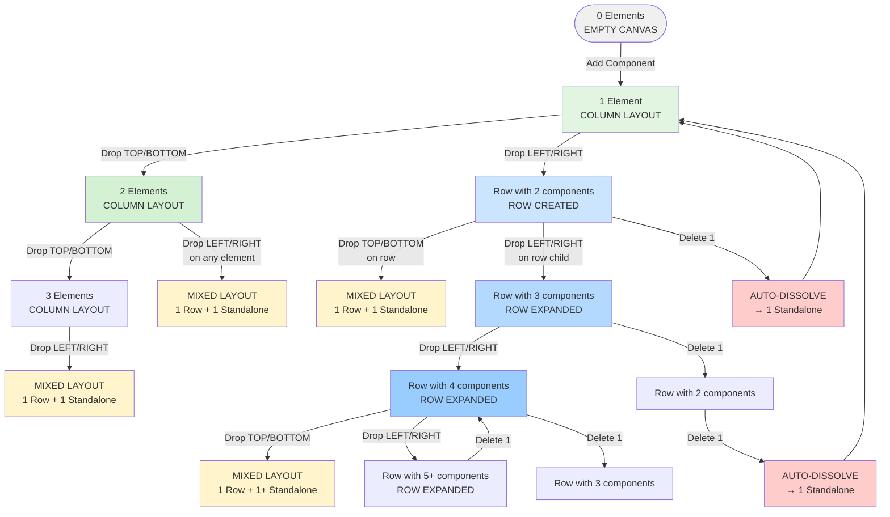

### Detailed 1→2 Elements Decision

```mermaid
graph TD
    Start([1 Component on Canvas]) --> AddSecond[Add 2nd Component]
    
    AddSecond --> WhereDropped{Where dropped<br/>relative to first?}
    
    WhereDropped -->|TOP 30%| Above[Insert ABOVE<br/>Column Layout]
    WhereDropped -->|BOTTOM 30%| Below[Insert BELOW<br/>Column Layout]
    WhereDropped -->|LEFT 20%| Left[Create Row<br/>[new, target]]
    WhereDropped -->|RIGHT 20%| Right[Create Row<br/>[target, new]]
    
    Above --> Result1[Canvas Column<br/>├── Component 2<br/>└── Component 1]
    Below --> Result2[Canvas Column<br/>├── Component 1<br/>└── Component 2]
    Left --> Result3[Canvas Column<br/>└── Row 2/4<br/>    ├── Component 2<br/>    └── Component 1]
    Right --> Result4[Canvas Column<br/>└── Row 2/4<br/>    ├── Component 1<br/>    └── Component 2]
    
    Result1 --> End([2 Components])
    Result2 --> End
    Result3 --> End
    Result4 --> End

    style Above fill:#d4f1d4
    style Below fill:#d4f1d4
    style Left fill:#cce5ff
    style Right fill:#cce5ff
```

### Growth Path Example

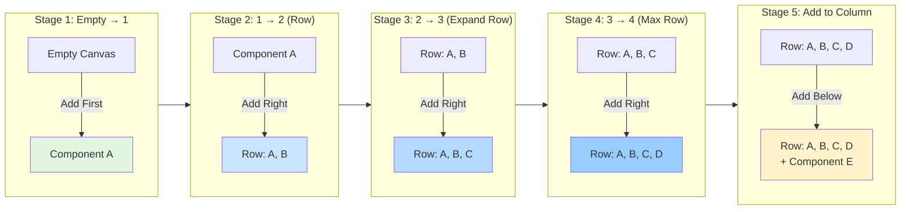

---

## 8. Validation System

### Main Validation Flow

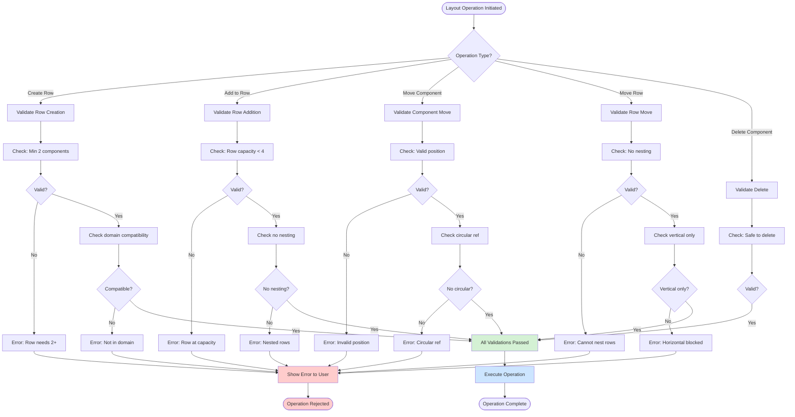

### Constraint Enforcement

```mermaid
graph TD
    subgraph RowConstraints ["Row Layout Constraints"]
        direction TB
        R1[Min: 2 components]
        R2[Max: 4 components]
        R3[Drop zones: LEFT, RIGHT only]
        R4[No nested rows]
        R5[Auto-dissolve if ≤1 child]
    end
    
    subgraph ColumnConstraints ["Column Layout Constraints"]
        direction TB
        C1[Unlimited components]
        C2[Drop zones: TOP, BOTTOM]
        C3[Always the canvas base]
        C4[Contains rows + standalone]
    end
    
    subgraph ComponentConstraints ["Component Constraints"]
        direction TB
        CO1[Unique field IDs]
        CO2[Required: type, id, label]
        CO3[Domain compatibility]
        CO4[No circular references]
    end
    
    subgraph DomainConstraints ["Domain Constraints"]
        direction TB
        D1[Forms: All components]
        D2[Surveys: Limited set]
        D3[Workflows: Action-focused]
        D4[Enforce filters]
    end

    style RowConstraints fill:#cce5ff
    style ColumnConstraints fill:#d4f1d4
    style ComponentConstraints fill:#fff4cc
    style DomainConstraints fill:#ffe6cc
```

---

## 9. Complex Mixed Layout Flow

### Building a Complex Form

```mermaid
graph TD
    Start([Empty Canvas]) --> Add1[Add Component:<br/>Heading]
    
    Add1 --> State1[Canvas<br/>└── Heading]
    
    State1 --> Add2[Add RIGHT of Heading:<br/>First Name]
    
    Add2 --> State2[Canvas<br/>└── Row: Heading, First Name]
    
    State2 --> Problem{Wait - Problem!<br/>Heading shouldn't<br/>be in row}
    
    Problem --> Undo[Undo last action]
    
    Undo --> State1b[Back to:<br/>Canvas<br/>└── Heading]
    
    State1b --> Add2b[Add BELOW Heading:<br/>First Name]
    
    Add2b --> State2b[Canvas<br/>├── Heading<br/>└── First Name]
    
    State2b --> Add3[Add RIGHT of First Name:<br/>Last Name]
    
    Add3 --> State3[Canvas<br/>├── Heading<br/>└── Row: First Name, Last Name]
    
    State3 --> Add4[Add BELOW Row:<br/>Email]
    
    Add4 --> State4[Canvas<br/>├── Heading<br/>├── Row: First Name, Last Name<br/>└── Email]
    
    State4 --> Add5[Add BELOW Email:<br/>Phone]
    
    Add5 --> State5[Canvas<br/>├── Heading<br/>├── Row: First Name, Last Name<br/>├── Email<br/>└── Phone]
    
    State5 --> Add6[Add RIGHT of Phone:<br/>City]
    
    Add6 --> State6[Canvas<br/>├── Heading<br/>├── Row: First Name, Last Name<br/>├── Email<br/>└── Row: Phone, City]
    
    State6 --> Final([Complex Mixed Layout Complete])

    style Problem fill:#ffcccc
    style Undo fill:#fff4cc
    style Final fill:#d4f1d4
```

### Rearrangement in Mixed Layout

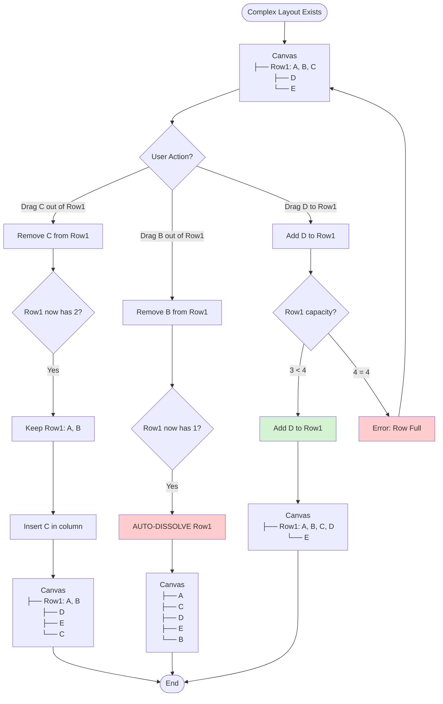

---

## 10. Edge Case Handling

### Corner Drop Resolution

```mermaid
graph TD
    Start([Mouse in Corner Zone]) --> Detect[Detect:<br/>Both horizontal AND<br/>vertical zones active]
    
    Detect --> Example[Example:<br/>xPercent = 0.15 LEFT<br/>yPercent = 0.25 TOP]
    
    Example --> Priority{Priority Rule}
    
    Priority -->|Rule 1| Horiz[HORIZONTAL wins<br/>over vertical]
    
    Horiz --> Result[Return: LEFT]
    Result --> Why[Why?<br/>Horizontal creates rows<br/>which is more specific<br/>than column insert]
    
    Why --> AllCorners[All Corner Cases:]
    
    AllCorners --> TL[Top-Left → LEFT]
    AllCorners --> TR[Top-Right → RIGHT]
    AllCorners --> BL[Bottom-Left → LEFT]
    AllCorners --> BR[Bottom-Right → RIGHT]
    
    TL --> End([End])
    TR --> End
    BL --> End
    BR --> End

    style Horiz fill:#cce5ff
    style Result fill:#d4f1d4
```

### Row Interior Blocked Drop

```mermaid
graph TD
    Start([Drop on Row Layout]) --> CalcY[Calculate yPercent<br/>relative to row]
    
    CalcY --> TopZone{yPercent < 0.15?}
    
    TopZone -->|Yes| AboveRow[Drop ABOVE row<br/>Insert in column]
    TopZone -->|No| BottomZone{yPercent > 0.85?}
    
    BottomZone -->|Yes| BelowRow[Drop BELOW row<br/>Insert in column]
    BottomZone -->|No| Interior[In row interior<br/>15% < y < 85%]
    
    Interior --> FindChild[Find which child<br/>mouse is over]
    
    FindChild --> HasChild{Found child?}
    
    HasChild -->|Yes| ChildZones[Apply standard detection<br/>to child component]
    HasChild -->|No| Gap[In gap between children]
    
    ChildZones --> ChildResult[Return child's zones:<br/>LEFT, RIGHT, BEFORE, AFTER]
    
    Gap --> Blocked[BLOCKED<br/>Return NULL]
    
    AboveRow --> End([End])
    BelowRow --> End
    ChildResult --> End
    Blocked --> End

    style AboveRow fill:#d4f1d4
    style BelowRow fill:#d4f1d4
    style ChildResult fill:#cce5ff
    style Blocked fill:#ffcccc
```

### Circular Reference Prevention

```mermaid
graph TD
    Start([Dragging Row Layout]) --> Over[Mouse over target]
    
    Over --> Check{Is target a child<br/>of dragged row?}
    
    Check -->|No| Safe[Safe to drop]
    Check -->|Yes| Circular[CIRCULAR REFERENCE<br/>DETECTED]
    
    Safe --> Allow[Show blue indicator<br/>Allow drop]
    
    Circular --> Block[Show red indicator<br/>Block drop]
    Block --> Error[Show Error:<br/>'Cannot drop row<br/>inside its own children']
    
    Error --> Example[Example:<br/>Row contains: A, B, C<br/>User tries to drop<br/>row on component B<br/>→ BLOCKED]
    
    Allow --> End1([End - Valid])
    Example --> End2([End - Blocked])

    style Safe fill:#d4f1d4
    style Circular fill:#ffcccc
    style Block fill:#ffcccc
```

### Same-Row Rearrangement

```mermaid
graph TD
    Start([Drag Component Within Same Row]) --> Before[Row: A, B, C, D<br/>sourceIndex: 1 B<br/>targetIndex: 3 D]
    
    Before --> Remove[Remove from sourceIndex<br/>Row: A, C, D<br/>B removed]
    
    Remove --> Adjust[Adjust targetIndex<br/>sourceIndex 1 < targetIndex 3<br/>→ targetIndex--<br/>→ New targetIndex: 2]
    
    Adjust --> Position{Drop position?}
    
    Position -->|LEFT| InsertLeft[Insert at adjusted index<br/>Row: A, C, B, D]
    Position -->|RIGHT| InsertRight[Insert at adjusted index + 1<br/>Row: A, C, D, B]
    
    InsertLeft --> Result1[Final: A, C, B, D]
    InsertRight --> Result2[Final: A, C, D, B]
    
    Result1 --> End([End])
    Result2 --> End

    style Before fill:#fff4cc
    style Remove fill:#ffe6cc
    style Adjust fill:#cce5ff
    style Result1 fill:#d4f1d4
    style Result2 fill:#d4f1d4
```

---

## Quick Reference Diagram

### Complete Layout Decision Tree

```mermaid
graph TD
    Start([Drag & Drop Initiated]) --> Source{Drag Source?}
    
    Source -->|Palette| New[Create New Component]
    Source -->|Canvas| Move[Move Existing Component]
    
    New --> Position{Drop Position?}
    Move --> Position
    
    Position -->|TOP/BOTTOM<br/>30%| Column[Column Layout Logic]
    Position -->|LEFT/RIGHT<br/>20%| Row[Row Layout Logic]
    Position -->|CENTER<br/>50%| Check{Target Type?}
    
    Check -->|Row Layout| Blocked[BLOCKED]
    Check -->|Component| Column
    
    Column --> Insert[Insert in Column<br/>BEFORE or AFTER]
    
    Row --> InRow{Target in Row?}
    
    InRow -->|No| CreateRow[Create New Row<br/>2 components]
    InRow -->|Yes| Capacity{Capacity < 4?}
    
    Capacity -->|No| Error[Error: Row Full]
    Capacity -->|Yes| AddRow[Add to Row]
    
    Insert --> Cleanup{Source was<br/>in Row?}
    CreateRow --> Cleanup
    AddRow --> Cleanup
    
    Cleanup -->|Yes| Count{Remaining ≤1?}
    Cleanup -->|No| Success
    
    Count -->|Yes| Dissolve[Auto-Dissolve<br/>Old Row]
    Count -->|No| Success
    
    Dissolve --> Success[Update State<br/>Add to History<br/>Re-render]
    
    Error --> End1([Reject])
    Blocked --> End1
    Success --> End2([Complete])

    style CreateRow fill:#cce5ff
    style Dissolve fill:#ffcccc
    style Error fill:#ffcccc
    style Blocked fill:#ffcccc
    style Success fill:#d4f1d4
```

---

## How to Use These Diagrams

### For Developers:
1. **Start with Master Flow** (Diagram 1) - Understand the complete process
2. **Deep-dive specific areas** - Follow diagrams 2-10 for details
3. **Reference during coding** - Keep Quick Reference visible
4. **Debug with diagrams** - Trace your code path through flowcharts

### For QA/Testing:
1. **Extract test cases** - Each decision point = test scenario
2. **Cover all paths** - Ensure every arrow is tested
3. **Validate edge cases** - Diagrams 10 shows all edge cases
4. **State validation** - Use transition diagrams for state testing

### For Product/Design:
1. **Understand complexity** - See how intricate the system is
2. **Explain to stakeholders** - Visual representation of logic
3. **Plan enhancements** - See where features fit in flow
4. **Document decisions** - Use diagrams in specification docs

---

## Legend

```mermaid
graph LR
    subgraph Shapes ["Shape Meanings"]
        Start([Start/End - Rounded])
        Process[Process - Rectangle]
        Decision{Decision - Diamond}
        Result([Result - Double Rounded])
    end
    
    subgraph Colors ["Color Meanings"]
        Success[Success - Green]
        Warning[Warning - Yellow]
        Error[Error - Red]
        Info[Info - Blue]
        Neutral[Neutral - Gray]
    end

    style Success fill:#d4f1d4
    style Warning fill:#fff4cc
    style Error fill:#ffcccc
    style Info fill:#cce5ff
    style Neutral fill:#f0f0f0
```

---

**END OF LAYOUT LOGIC FLOWCHARTS**

*Version: 1.0*  
*Last Updated: October 31, 2025*

**View these diagrams at:** https://mermaid.live  
**Paste the code blocks** from this document to see interactive flowcharts.